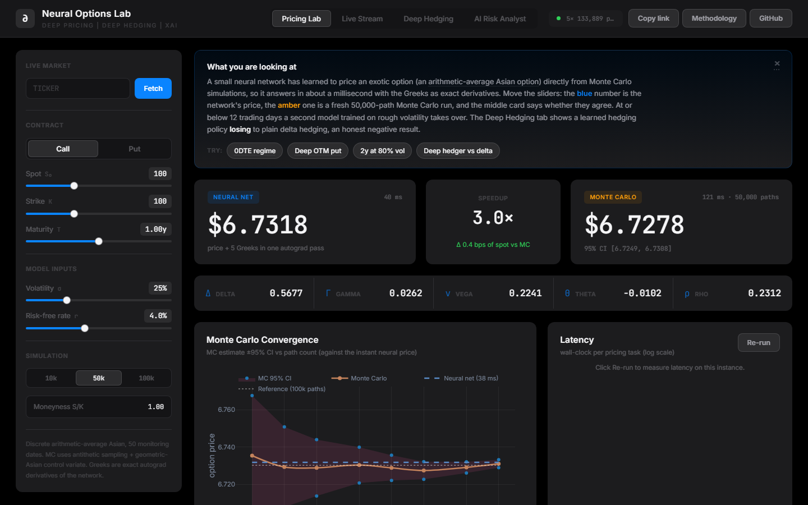

# Neural Options Lab

[](https://github.com/Ronak-Mahajan/neural-options-lab/actions/workflows/ci.yml)
[](https://neural-options-lab.onrender.com)
[](https://www.python.org/downloads/)



**Live demo: [neural-options-lab.onrender.com](https://neural-options-lab.onrender.com)**. It runs on an always-on paid instance, so there is no wake-up delay on first load. Every number on the dashboard is computed live by the models described below.

A neural network that prices arithmetic Asian options roughly 750x faster per price than the 400,000-path Monte Carlo reference it is scored against and 33x more accurately than the Levy (1992) closed-form approximation over the full trained box (Curran's 1994 conditioning approximation is more accurate still on price alone; see [docs/approximation_benchmark.md](docs/approximation_benchmark.md)), wrapped in an interactive dashboard you can run locally in two commands.

The project covers the full stack of a modern quant pricing system: the numerical methods that generate ground truth, the deep learning that learns to imitate them, a rough volatility model for same-day-expiry options, a reinforcement-style hedging agent, live market calibration, and a browser front end that ties it together. Trained model weights are included, so it runs the moment you clone it.

Built with PyTorch, FastAPI, and plain JavaScript with Plotly. No frontend build step.

## Results at a glance

Every figure here is measured; the sections below say how.

- **Pricing.** The neural surrogate prices an arithmetic Asian option in 633 µs against the 480 ms its 400,000-path Monte Carlo reference takes, both timed in the same run by `scripts/benchmark_approximations.py` ([docs/approximation_benchmark.md](docs/approximation_benchmark.md)); absolute times are specific to the machine that ran it, the ratio between the rows is not. Price RMSE is 1.33 basis points of strike on 600 held-out points against 200,000-path references (`artifacts/eval.json`). Against Levy (1992) moment matching it is 33x more accurate, at 633 µs against Levy's 55 µs.
- **Variance reduction.** Antithetic sampling with a geometric-Asian control variate cuts the Monte Carlo standard error by about 24x (24.0x at 5,000 paths, 24.5x at 20,000), measured as the ratio of empirical standard deviations across 300 seeded replications.
- **0DTE.** The rough Bergomi ensemble serving maturities of 12 trading days or less is calibrated to the live SPY smile: the served checkpoint carries the accepted 2026-08-20 fit (η 3.657, ρ −0.628, H 0.255; 1.568 vol points over 618 quotes, adopted in commit `82c54bb`), recorded in `artifacts/rough_calibration_20260820.json` and named by the provenance note `train_0dte.py` stamps into the checkpoint metadata alongside a `calibrated` flag. `dataset_0dte.py` reads that same file, so re-running the documented recipe regenerates the dynamics the served model was trained on. That artifact is a record read out of the checkpoint's own metadata, not a re-fit: the optimiser inputs behind it were not preserved, so the fields it cannot attest to are null. Its recorded ensemble validation RMSE is 3.3 bps of strike against its 20,000-path training labels; the arbitrage audit, which re-prices the served checkpoint against 4 × 400,000-path rough Bergomi references, measures 1.9-3.8 bps of price RMSE at its hardest smiles (1-5 days, 10% vol) and 0.8-2.3 bps on the rest, with a largest single-strike error of 14.4 bps ([docs/no_arbitrage_surface.md](docs/no_arbitrage_surface.md)). A held-out evaluation against high-precision references, comparable to `artifacts/eval.json` for the main pricer, is still to be re-measured for this checkpoint; see [the 0DTE section](#the-0dte-model-driver-fix-regeneration-and-live-calibration).
- **Deep hedging.** Evaluated out of sample on risk-neutral GBM over a 12-cell (σ, cost) grid with 15,000 paths per cell, the learned CVaR policy loses to a vol-matched delta hedge in 7 of 12 cells and to Whalley-Wilmott in 11 of 12.
- **Deep hedging under rough volatility.** On a rough Bergomi + jumps measure with transaction costs, a policy trained under those dynamics reaches a lower CVaR₉₅ than a vol-matched delta hedge from 50 bp of cost (404 ± 7 vs 493 ± 11 bp of strike) and than a Whalley-Wilmott band from 100 bp, at a third of the delta hedge's turnover — which is where most of the gap comes from: 78.5 of those 88.5 bp is a smaller commission bill and 10.0 bp is tail shape, and on demeaned tail alone the Whalley-Wilmott band is ahead below 200 bp. Evaluated on Black-Scholes paths the same policy loses. Caveat: the measure's parameters come from `artifacts/rough_calibration.json`, the 2026-08-21 SPY fit whose own quality gate marks it `accepted: false` (η at the 4.0 bound); the served 0DTE checkpoint carries a different, accepted fit (H 0.255). The rejection is a caveat on the dynamics, not on the paired comparison. Full grid with standard errors in [docs/deep_hedging_regimes.md](docs/deep_hedging_regimes.md).
- **Deep hedging on real paths.** Replaying the same three hedgers over 384 SPY and 567 BTC-USD rolling 30-day windows of real daily closes with ex-ante vol, the simulated tail advantage does not transfer (at 10 bp of cost plain delta has the better CVaR₉₅ on both assets: SPY 0.027 vs 0.041), while the cost efficiency does (at 50 bp the deep policy has the better mean P&L on SPY, −0.65% vs −1.35%, on 69% of windows, trading half as much, with still wider tails). Measured 2026-08-20 (commit `0785c91`) and replayed 2026-09-11 with the output committed. [docs/hedging_real_paths.md](docs/hedging_real_paths.md).
- **Rough-volatility skew.** The at-the-money skew of listed SPY expiries steepens toward expiry with exponent −0.249 ± 0.033, against the rough-volatility prediction H − ½ = −0.239 at H = 0.261; the rough Bergomi engine reproduces the law in its asymptotic regime and steepens beyond it at the calibrated vol-of-vol. Same caveat as above: H = 0.261 and η = 3.9 are the gate-rejected `rough_calibration.json` parameters, while the served checkpoint's accepted fit has H = 0.255 (H − ½ = −0.245, also within one standard error of the market exponent). Measurement and figure in [docs/atm_skew_term_structure.md](docs/atm_skew_term_structure.md).
- **Joint (H, η) refit.** Adding the per-expiry ATM skew to the calibration objective moves rough Bergomi's optimum to H = 0.31, ρ = −0.50, forward vol 12.5 % (bootstrap H 0.308 ± 0.011) and puts the Monte Carlo skew exponent at −0.264 ± 0.007, half a market SE from −0.249, for 0.45 vol points of smile RMSE; at the gate-rejected `rough_calibration.json` parameters above the exponent is −0.330, 2.5 SE away. Profile, Pareto front and validation in [docs/joint_skew_refit.md](docs/joint_skew_refit.md).
- **Static-arbitrage audit of the Asian pricer.** Audited by autograd on 120,800 points in price space over its own trained box, the served Asian ensemble prices negative gamma on 18.6% of the box, negative vega on 28.1%, a delta above the forward bound on 14.1%, and sits below the Asian floor e^{−rT}(E[A] − K)⁺ on 9.9% (worst 5.98 bps of strike). Inside the vega-resolved region (42.6% of the box, where a reference vega of 0.02 makes an implied reading meaningful) only 0.060% of convexity and 0.016% of butterflies violate, and every other condition is clean. The violations sit where the true surface is affine and the network's smooth residual supplies the curvature. [docs/asian_arbitrage_audit.md](docs/asian_arbitrage_audit.md).
- **Arbitrage-free implied-vol surface.** Audited by autograd on 134,100 points, the 0DTE pricing ensemble violates the Durrleman butterfly condition on 4.9% of its box and the calendar condition on 10.5% (edges: deep ITM, low vol, 1-2 days); a constrained total-variance network trained against it with butterfly, calendar and Lee-slope penalties has zero violations on the same grid at 0.22 vol points IV RMSE, and the dashboard evaluates both conditions live. [docs/no_arbitrage_surface.md](docs/no_arbitrage_surface.md).
- **Heston as the classical reference.** A COS-method Heston pricer verified against the published reference to 8e-9, put-call parity to 1e-11 and Monte Carlo within 1 SE; calibrated to the same SPY captures it fits the 2-10 day smiles at 0.85 vol points (rough Bergomi map: 1.10) only with mean reversion at its 100/yr bound, and its skew term structure then has exponent −0.66 against the market's −0.25. [docs/heston_reference.md](docs/heston_reference.md).

## Try it

Three links into the live dashboard, each opening on a case discussed below. The dashboard reads these parameters from the URL, so they are visible and editable.

- [0DTE regime](https://neural-options-lab.onrender.com/?tab=pricing&spot=100&strike=100&T=0.02&sigma=0.25&rate=0.04&type=call): an at-the-money call with T = 0.02 years, inside the 12-trading-day cutoff, so the price comes from the rough Bergomi 0DTE ensemble and the Monte Carlo benchmark switches to the rough Bergomi engine.
- [Deep out-of-the-money put](https://neural-options-lab.onrender.com/?tab=pricing&spot=160&strike=100&T=1&sigma=0.25&rate=0.04&type=put): spot 160 against strike 100, where the true price is close to zero.
- [Deep hedging](https://neural-options-lab.onrender.com/?tab=hedging&dyn=rough&cost=100&run=1): the CVaR-trained policy against a vol-matched delta hedge and a Whalley-Wilmott band on SPY-calibrated rough Bergomi + jumps dynamics with 100 bp of proportional transaction cost, reported with bootstrap standard errors; switch the dynamics to Black-Scholes to see the same policy family lose.

## Why this is not trivial

Arithmetic Asian options have no exact closed-form price. The payoff depends on the average price over the option's life, so the standard way to value one is Monte Carlo simulation, which is accurate but slow: the 400,000-path reference this project scores against takes 480 milliseconds for a single price, and a trading desk needs thousands of prices and their risk sensitivities (the Greeks) refreshed continuously.

A neural network trained on Monte Carlo prices learns the pricing function itself. Once trained it prices the same contract in about 633 microseconds and returns all five Greeks as exact derivatives of the network through automatic differentiation, not finite differences. Price plus all Greeks together costs roughly twelve times a price-only call, because gamma needs a second backward pass through five ensemble members. That turns a batch job into something interactive.

The interesting part is doing this with enough numerical care that the surrogate's error is known rather than assumed: sub-2-basis-point pricing error, delta and vega measured against pathwise Monte Carlo references and theta and rho against their own analytic checks, and a separate model for the short-dated regime where the usual assumptions break down. Gamma carries no independent error bar, and no experiment in this project has yet hedged a path with the surrogate's own Greeks.

This README states measured numbers and retracts the ones that did not survive measurement. Where an earlier version overclaimed, the correction is left in place rather than quietly edited out.

## What it does

The dashboard has three sections.

**Pricing Lab.** Set the contract parameters or pull live market data for a ticker, and see the neural price next to a fresh Monte Carlo price with a confidence interval, all five Greeks, a convergence chart, a latency comparison, an error-distribution chart, a 3D price surface, and a feature-attribution breakdown of what is driving the price.

**Deep Hedging.** Simulate 3,000 paths of hedging a short option to expiry under transaction costs. A neural policy trained to minimize tail risk (conditional value at risk) is compared against the textbook Black-Scholes delta hedge on the same paths, with the full profit-and-loss distributions side by side.

**AI Risk Analyst.** Streams a plain-English risk summary built from the pricing, hedging, and attribution numbers. It uses an open-source Llama 3 model through Groq when an API key is present, and a deterministic offline summary otherwise, so the feature always works.

## Quickstart

You need Python 3.12. The trained checkpoints are in the repo, so you do not need to train anything to try it.

```bash
git clone https://github.com/Ronak-Mahajan/neural-options-lab.git
cd neural-options-lab
python -m pip install -r requirements.txt
python -m uvicorn backend.api.main:app --port 8000
```

Open http://localhost:8000. Interactive API docs are at http://localhost:8000/docs.

To run it in a container instead:

```bash
docker build -t neural-options-lab .
docker run -p 8000:8000 neural-options-lab
```

The live-news feature of the risk analyst and the live-quote features are optional. Set `GROQ_API_KEY` (free tier at console.groq.com) to enable the language model; without it the offline summary is used.

To host it somewhere public so it opens from a link instead of a local clone, see [DEPLOY.md](DEPLOY.md). The app is a single service that serves the API and the dashboard together, so any host that runs the Docker image works.

## How it works

| Piece | Approach |
|---|---|
| Monte Carlo engine | Antithetic sampling with a geometric-Asian control variate (Kemna and Vorst, 1990). Cuts the standard error by about 24x (24.0x at 5,000 paths, 24.5x at 20,000), measured as the ratio of empirical standard deviations across 300 seeded replications. An earlier version of this README claimed "about 30x"; that figure came from the reported standard error, which was computed as if antithetic pairs were independent and overstated the true error by ~45%. Both the estimator and the claim are fixed. |
| Parameterization | The network prices the unit-strike call as a function of moneyness (spot over strike). Option prices scale linearly in spot and strike, so one model covers every strike exactly. Puts come from Asian put-call parity, which is exact. |
| Architecture | A residual multilayer perceptron with SiLU activations and LayerNorm, about 134k parameters. Smooth activations matter here because the Greeks are computed by differentiating the network, and something like ReLU would give zero gamma almost everywhere. |
| Differential Machine Learning | Huge and Savine (2020). The pathwise delta and vega are computed on the same Monte Carlo paths that produce the price, for almost no extra cost, and the network is trained to match both the prices and their derivatives in a variance-normalized combined loss. This teaches the model the shape of the pricing function rather than only its level. |
| Deep ensemble | Five independently initialized networks. Averaging them lowers error, and the Greeks average cleanly through the mean. |
| Same-day-expiry (0DTE) model | Very short-dated option smiles show a power-law skew that classical models cannot reproduce. A rough Bergomi Monte Carlo engine generates training data for a separate ensemble serving maturities of 12 trading days or less. The driver is the Riemann-Liouville Volterra process (Bayer-Friz-Gatheral 2016) simulated exactly via the joint law of the driving Brownian motion and the Volterra integral. The served checkpoint is trained on the dynamics of the accepted 2026-08-20 live SPY calibration (η 3.657, ρ −0.628, H 0.255) and records that provenance in its own metadata (`calibrated: true` plus a note naming the fit). |
| Live calibration | `calibrate.py` fits the rough volatility parameters (η, ρ, H and the forward variance ξ, jointly) to the SPY option smile using a vega-weighted Huber loss, global search with differential evolution, and a local polish, then applies a quality gate (RMSE, bound-pinning, staleness) before a fit can be adopted. It can then regenerate the training set and retrain the 0DTE model on the calibrated dynamics. `calibrate_deribit.py` does the same for BTC on Deribit, and `calibrate_map.py` runs either fit in seconds on a CPU through a regionally validated neural pricing map (see below). |
| Deep hedging | Buehler and coauthors (2019). A policy network maps the hedging state to a position and is trained to minimize the 95% conditional value at risk of the terminal loss, with transaction costs inside the objective. Benchmarked against a vol-matched Black-Scholes delta hedge **and** a cost-aware Whalley-Wilmott no-trade band on identical paths, under GBM, rough Bergomi with jumps, and real SPY/BTC price history. It loses to both on GBM (the negative result below), has the lower CVaR₉₅ under rough volatility with costs — mostly by trading less ([docs/deep_hedging_regimes.md](docs/deep_hedging_regimes.md)) — and on real paths keeps only its cost efficiency, not its tail advantage ([docs/hedging_real_paths.md](docs/hedging_real_paths.md)). |
| Market simulator for hedging | A Wasserstein GAN trained on historical SPY returns generates fat-tailed paths, mapped onto the pricing measure by enforcing the terminal variance and the martingale condition. Known limitation: the shipped generator is mode-collapsed (participation ratio 4.66 of 30 factors), so its paths are forecastable and it is not a sound measure for evaluating a hedging policy. Quantified in `docs/hedging_findings.md`. |
| Real market data | A live [Deribit](https://www.deribit.com) option chain: 836 BTC instruments across 12 expiries, fetched from public endpoints with no API key. Coin-denominated premiums are converted on the per-expiry forward, implied vol is inverted on BOTH bid and ask so the market shows as a band, and the surface is checked for butterfly, vertical, calendar and put-call-parity arbitrage. Everything downstream reads a committed snapshot, so it runs offline. See [`docs/real_market_data.md`](docs/real_market_data.md). |
| Explainability | Integrated Gradients through the ensemble against an at-the-money baseline, with the completeness check (attributions sum to the price difference) reported alongside. |

## Results

Everything below is measured, not asserted. The evaluation script prices a held-out test set
against high-precision (200,000-path) Monte Carlo references. The test set is a fresh Latin
hypercube from the same `PARAM_RANGES` box, labelled by the same simulator, so these figures
are interpolation error inside the trained box rather than evidence of generalisation beyond
it; the Curran cross-check in [docs/approximation_benchmark.md](docs/approximation_benchmark.md)
is the independent arbiter on price.

Main pricer, 5-member ensemble, 600 test points, against the served `artifacts/model.pt`
(`artifacts/eval.json` carries the checkpoint's sha256 and a regression test fails the suite
if the two ever drift apart):

| Quantity | Error (RMSE) |
|---|---|
| Price | 1.3 basis points of strike |
| Delta | 7.3e-4 |
| Vega | 13e-4 |

### The price error is mostly a fixable bias, not a noise floor

Reading the 1.4 bp the previous head measured as the label noise floor is the wrong reading,
and finding out why produced the most interesting result in the project.

On the 600 held-out points that head measured, **89.3% of price errors were positive** and the
mean accounted for **47.6% of total MSE**. Bucketing by true price magnitude showed a flat additive offset
(+1.05, +1.03, +1.06, +1.20, +0.89 bps across five decades of price), and at points where
the true price is below 0.01 bps the network still predicted ~1.08 bps and never went below
0.898. The cause is the output layer: `nn.Softplus()` cannot emit zero, so it floors at
about 1 bp and lifts the whole surface.

Two fixes were tested at full scale (500,000 labels, 5,000 paths each, 400 epochs,
5-member ensembles, both arms identical except for the one change under test; see
`scripts/fullscale_ablation.py` and `artifacts/ablation.json`):

| model | RMSE | bias | % positive | bias²/MSE |
|---|---|---|---|---|
| previous `model.pt` | 1.489 bps | +0.966 | 89.3% | 42.1% |
| **conditioned head (now served)** | **1.301 bps** | **+0.404** | 78.1% | **9.7%** |
| residual over geometric Asian | 1.823 bps | +0.925 | 86.8% | 25.7% |

The conditioned head is now the served checkpoint. Promotion is gated:
`scripts/promote_model.py` re-prices a fresh 1,500-point test set against
200,000-path references on a seed used by neither training nor the ablation, and
writes `model.pt` only if the candidate beats the incumbent on **both** RMSE and
|bias|. The previous checkpoint is kept as `model_legacy_unconditioned_head.pt`.
Swapping a served model on a training-time validation number is what let the old
head carry a +0.99 bp bias that looked like an irreducible noise floor.

The independent 600-point evaluation above agrees with the ablation on the size of
the effect: on the served head the mean error is +0.45 bps and accounts for 11.5%
of MSE, against +0.97 bps and 47.6% on the head it replaced, with 79.0% of errors
positive against 89.3%. The price of it is dispersion — the served head's 95th
percentile is 2.6 bps against 2.4, and its worst point 10.0 bps against 8.4. The
served head's figures are `artifacts/eval.json`; the legacy head's are the same
file at commit `2de187d`, measured under the identical protocol.

**What the promotion actually bought, and what it cost.** Paired comparison, both
models priced on the same 1,500 points against the same references:

| | price RMSE | price bias | delta RMSE | vega RMSE |
|---|---|---|---|---|
| legacy (unconditioned head) | 1.531 | +1.032 | **7.338e-4** | **17.757e-4** |
| promoted (conditioned head) | **1.366** | **+0.468** | 7.768e-4 | 17.978e-4 |

Price RMSE improves 10.8% and the systematic bias halves. **Delta gets 5.9%
worse and vega 1.2% worse.** That is a real regression and it is stated rather
than buried: conditioning the output head helps the level and slightly hurts the
shape, which is what you would expect from changing where the magnitude lives in
a network trained on a joint price-and-derivative loss. The promotion is kept
because price accuracy is this model's primary claim, but a service that hedges
off these Greeks should weigh that differently.

The first version of the gate tested price only, so it did not see the Greeks
regression at all. It now reports delta and vega alongside; they are reported,
not blocking, and the reason is written into the script.

Two further caveats. The gain is concentrated in the systematic component: p95
absolute error is essentially unchanged (2.609 vs 2.595 bps) and the worst case
is marginally wider (10.34 vs 10.20). And the absolute RMSE is heavy-tailed
enough that it moves with the test draw: the same promoted checkpoint measures
1.301, 1.329, 1.366 and 1.488 bps on four independent Latin-hypercube draws. The
*paired* comparison above is the meaningful one, because both models see
identical points and identical references.

*Head conditioning*, which carries the output magnitude in a fixed scale with the Softplus head
initialized near unity, **halved the systematic bias**. The previous initialization started
every run at `softplus(0) = 0.693`, i.e. 6,930 bps against a mean price of 3,664 bps.

*Residual over geometric* did **not** work, and that is a real result. Since AM-GM gives
`C_arith ≥ C_geo` pathwise, learning only the residual should have shrunk what the Softplus
floor can distort. It made things 37% worse, because the residual has a 3.8x wider relative
dynamic range (p99/p50 of 12.46 versus 3.27) and that outweighs the 21x smaller output
scale. Hypothesis tested, hypothesis refuted.

### Is a neural surrogate even the right tool?

Arithmetic Asians have had fast closed-form approximations since the early 1990s, so the
honest comparison is not only against Monte Carlo. Against Levy (1992) moment matching, on
300 points versus 200,000-path references:

| method | RMSE | bias | p95 abs err |
|---|---|---|---|
| neural ensemble | 1.329 bps | +0.548 | 2.376 |
| Levy moment matching | 44.344 bps | +19.813 | 103.300 |
| Monte Carlo, 200k paths | (reference) | n/a | n/a |

**33x more accurate** than Levy over the full trained box. The scope matters: it is an RMSE
ratio over a box where volatility runs to 80%, and Levy's error is a bias that grows with
maturity, so at a more typical σ = 0.25 the margin narrows to about 5x (0.72 against
3.65 bps of mean absolute error).

The latency column belongs to a separate, re-runnable measurement rather than to this table:
`scripts/benchmark_approximations.py` times the surrogate, both closed forms and the Monte
Carlo reference in one process and writes [docs/approximation_benchmark.md](docs/approximation_benchmark.md)
(633 µs, 55 µs, 75 µs and 479.94 ms per price on the machine that generated the committed
copy). Absolute times move with the machine: a re-run on different hardware measured 987 µs,
123 µs, 150 µs and 765 ms, with every accuracy column identical to three decimals. The ratios
between rows are what travel. Against Monte Carlo the ratio is about 750x, and it is not an
iso-accuracy comparison: the reference is far more accurate than the thing being timed.

Levy is also not the only closed form for an arithmetic Asian, and against the better one
the network loses on price: Curran's (1994) conditioning approximation is a rigorous lower
bound, and on a 36-cell grid at σ = 0.25 it is 6.9x more accurate than the ensemble at about
an eighth of the latency ([docs/approximation_benchmark.md](docs/approximation_benchmark.md)).
What the surrogate offers over Curran is differentiability — all five Greeks as exact
derivatives from the same pass — and batch throughput, not price accuracy.

The one regime where Levy still wins is where the true price is essentially zero
(0.082 vs 0.310 bps), which is the Softplus floor seen from an independent direction. Note
that gap narrowed by more than 3x when the head was conditioned (the floor shrank from
1.050 to 0.310 bps), which is corroboration from a completely different measurement that
the bias diagnosis was right.

### Latency, honestly

Only one latency measurement in this project is regenerated by a committed script:
`scripts/benchmark_approximations.py`, which writes
[docs/approximation_benchmark.md](docs/approximation_benchmark.md) and puts a single
price-only call at **633 µs** (`torch.set_num_threads(1)`, median of 20 calls per cell over
36 cells) next to its own 400,000-path reference at 479.94 ms. Re-running it on different
hardware reproduces every accuracy column to three decimals and moves every latency column
by about the same factor, so quote the ratios, not the absolute times.

The Greeks path costs roughly **twelve times a price-only call**, because gamma needs a
second backward pass for each of the five ensemble members. That ratio holds across the
machines this has been run on; the absolute figure does not, and no committed script
regenerates it, so this README no longer quotes one. An earlier README claim of "roughly a
millisecond for a single price plus all Greeks" was off by an order of magnitude and is
retracted. Batch throughput is reported live by `POST /api/benchmark`, measured on whichever
machine is serving, rather than pinned to a number here.

Label generation runs on the GPU in float64 (`backend/quant/gpu_labels.py`): 0.85 G
path-steps/s on an RTX 5080, so the full 500,000-label dataset takes 148 s instead of roughly
80 minutes on CPU. float64 is not optional: running the same kernel at float32 with
identical seeds injects 10.03 bps of price RMSE at 5,000 paths, several times the entire
error budget, because the control variate differences two deliberately near-identical
quantities. That GPU is no longer available to this project, so the figures in this
paragraph, and the GPU-versus-CPU serving comparison an earlier version of this section
carried, cannot be re-measured; serving is CPU-only in every committed path
(`PricingEngine` and `MapPricer` both load `map_location="cpu"`).

A controlled ablation (same sample budget, training on prices only versus the differential loss) cut delta error about 3x and vega error about 4x, which is the whole point of differential machine learning: better sensitivities for hedging.

### The 0DTE model: driver fix, regeneration and live calibration

Two defects were found by audit in the first 0DTE checkpoint, both invalidating claims
this README previously made. Both have since been fixed and the served checkpoint is
calibrated to a live SPY fit; the history is kept here because the corrections are part
of the measurement.

**The driver was the wrong process.** `rough_vol.py` built the Type-I
(Mandelbrot-Van Ness) fractional Brownian covariance
`0.5(t_i^2H + t_j^2H − |t_i−t_j|^2H)`. Rough Bergomi is driven by the
Riemann-Liouville Volterra process `W̃_t = √(2H)∫₀ᵗ(t−s)^(H−½)dW_s`. The two agree
on the diagonal (both give `Var[W̃_t] = t^2H`, which is why the martingale property
held and nothing looked wrong) and agree nowhere else: at H = 0.1172 the maximum
off-diagonal relative difference is **4.93**, and `corr(W̃_t1, W̃_t50)` was **+0.320**
against a true **+0.054**.

There was a second half to it. `chol(C)` is not the Volterra kernel, because W̃ is a
continuous stochastic integral rather than a linear function of n coarse increments.
Factorising C alone forces `corr(Z_1, W̃_t1) = 1` by construction when the truth is
`√(2H)/(H+½) = 0.7844`, so the leverage correlation ρ was being applied to the wrong
object, over-correlating spot and vol precisely at the short end where a 0DTE skew
fit is identified. Both are now fixed with the exact joint-Gaussian scheme, verified
against quadrature to 5.4e-08 and against 400,000 draws.

**`artifacts/model_0dte.pt` was regenerated** against the corrected driver on
2026-08-05. The wrong-kernel checkpoint is kept as `model_0dte_legacy_wrong_kernel.pt`
for comparison. The old "about 2 basis points against its rough Bergomi teacher" figure
described agreement with the *wrong* teacher; the 2026-08-05 checkpoint measured 1.48 bps
of strike RMSE, +0.13 bps bias and 2.76 bps p95 on 400 held-out points against
500,000-path references under the right one, below its 2.35 bps per-label noise floor.
That checkpoint has since been replaced twice by the calibration adoptions below, and
the 1.48 bps figure was never re-measured on the checkpoints that followed, so it is
not quoted as a property of the served model.

**The calibration was not live, and now is.** This README previously said the model was
"calibrated to the live SPY smile ... about 2 volatility points across 72 quotes and
two expiries." The calibration behind that statement was fitted at 03:43 New York from
the previous session's last trades (`quote_source: "last_trade_market_closed"`) and
passed a quality gate that tested only RMSE and bound-pinning. The gate now also rejects
stale sessions, and in the market-closed branch time-to-expiry is no longer stamped from
`now` against last-session prices (on synthetic quotes with known truth that error had
inflated √ξ by 21% and moved H by 0.021).

The served checkpoint was then rebuilt through the same `calibrate --retrain` path on
live fits, twice on 2026-08-20: first on the accepted 2026-08-10 fit (η 2.688, ρ −0.328,
H 0.104; 677 quotes, 8 expiries, 1.553 vol points; ensemble validation RMSE 3.8 bps,
commit `65e67c4`), then on the accepted 2026-08-20 15:47 EDT fit (η 3.657, ρ −0.628,
H 0.255; 618 quotes, 1.568 vol points; ensemble validation RMSE 3.3 bps, commit
`82c54bb`). The ten days between the two fits moved η from 2.69 to 3.66 and H from 0.104
to 0.255, the regime drift that motivated the CPU pricing map described under
[Repository layout](#repository-layout). Since `65e67c4`, `train_0dte.py` derives the
checkpoint's `calibrated` flag and provenance note from the dataset's own parameters
matched against the accepted calibration file, so the metadata cannot drift from the
weights.

What is measured on the served checkpoint:

| 0DTE ensemble, served checkpoint (2026-08-20 SPY calibration) | |
|---|---|
| ensemble validation RMSE vs 20,000-path training labels | 3.3 bps of strike (recorded at training, `82c54bb`) |
| price RMSE vs 4 × 400,000-path references, six smiles at 1/5/12 days and 10%/20% vol | 0.79 to 3.76 bps of strike (worst at 1 day, 10% vol), largest single strike 14.4 bps ([docs/no_arbitrage_surface.md](docs/no_arbitrage_surface.md), section 4) |
| below-intrinsic prices, 134,100-point audit grid | 6.8% of the trained box, by up to 24.8 bps (same doc) |
| held-out RMSE and bias vs 500,000-path references (the `eval.json` protocol) | to be re-measured |

Validation RMSE against noisy training labels overstates the true error (the 2026-08-05
checkpoint showed a 2.4x gap, 3.5 bps validation against 1.48 bps true), which is why
this project scores against high-precision references rather than against its own
training targets. The re-measurement for the served checkpoint is the
`backend/quant/evaluate.py` protocol applied to the rough regime: Latin-hypercube points
over the 0DTE box, references from `backend.quant.rough_vol.rough_bergomi_mc` under the
checkpoint's own dynamics (as `scripts/no_arbitrage_surface.py` already does for its
smiles), written to an `artifacts/eval_0dte.json` that `/api/model-info` can serve. Until
that artifact exists the table above is the whole of what this README claims for 0DTE
accuracy.

### Deep hedging: a negative result

**This section previously claimed the learned hedger "reduced 95% tail loss by roughly 30%
versus delta hedging." That claim was wrong and has been retracted.** It was measured
in-sample, against a handicapped baseline, on a measure that was not a valid pricing
measure. Full write-up in [`docs/hedging_findings.md`](docs/hedging_findings.md).

Three problems, all measured:

1. **The simulated measure was not risk-neutral.** `risk_neutralize` matched per-step
   marginals but left cross-step covariance free, so paths realized 1.28x the requested
   volatility and discounted spot was not a martingale (E[S_T] exceeded e^{rT} by up to
   147 bps). The option was booked at Black-Scholes while being worth ~30% more under the
   measure actually being simulated. Now fixed: terminal variance and the martingale
   condition are both enforced exactly, and the premium is priced under the simulated
   measure.
2. **The baseline was handicapped**, hedging at the requested σ while paths realized 1.28σ.
   On the old measure, vol-matching alone closed ~83% of the claimed gap.
3. **The comparison was in-sample on a degenerate generator.** The WGAN is mode-collapsed
   (participation ratio 4.66 of 30 factors), making its paths forecastable: R² = 0.8755
   regressing future returns on realized ones, versus 0.0006 for GBM. Minimizing CVaR there
   rewards market timing, not hedging.

After fixing 1 and 2 and adding a cost-aware Whalley-Wilmott baseline, evaluated
out-of-sample on risk-neutral GBM over a 12-cell (σ, cost) grid, 15,000 paths per cell:

| policy | beats vol-matched delta | median ratio | beats Whalley-Wilmott |
|---|---|---|---|
| trained on the fixed GAN measure | 2 / 12 | 1.469 | 0 / 12 |
| **trained on GBM (in-sample!)** | **5 / 12** | **1.085** | **1 / 12** |

A ratio above 1 means worse tail loss. Even trained and evaluated on the same correct
measure, the learned policy loses to a vol-matched delta hedge in 7 of 12 cells and to
Whalley-Wilmott in 11 of 12. **As implemented, deep hedging here does not beat a properly
specified baseline.** `compare()` now reports both measures side by side with bootstrap
standard errors and defaults its headline to the out-of-sample one.

Two follow-up experiments bracket that result. Under rough Bergomi with jumps and
transaction costs, an incomplete market where a static delta is no longer near-optimal,
a policy trained on those dynamics does reach a lower CVaR₉₅ than delta and Whalley-Wilmott
from 50-100 bp of cost, mostly by trading less: 89% of its 88.5 bp advantage over delta in
the in-sample cell at 50 bp is a smaller commission bill, and on demeaned tail alone the
Whalley-Wilmott band is still ahead below 200 bp
([docs/deep_hedging_regimes.md](docs/deep_hedging_regimes.md)). And on
real SPY and BTC-USD price history, with every hedger given only ex-ante information, the
tail advantage does not transfer while the cost efficiency does
([docs/hedging_real_paths.md](docs/hedging_real_paths.md), produced by
`scripts/hedge_real_paths.py`).

### Real market data

Everything else in this project is simulated. `backend/quant/deribit.py` and
`backend/quant/surface.py` are the exception: a live institutional option chain, and the
diagnostics you would actually run on one.

Measured on the committed snapshot (836 BTC options, 12 expiries, 0.42 to 323 days):

**The convention matters more than the code.** Deribit quotes premiums in BTC and reports a
per-expiry forward, not spot. Reading `price_usd = price_btc x forward` and inverting
Black-76 reproduces Deribit's own published `mark_iv` to a median of **0.0028 vol points**.
Reading the coin premium as a dollar price instead gives 4.62 vol points where the truth is
32.88, **wrong by 7.1x**, and wrong in a way that still produces a smooth, plausible
surface. The day count was pinned the same way: ACT/365 reproduces `mark_iv` to +0.0001 vol
points, against -0.2727 for a 360-day year.

**A real chain is mostly unusable.** 289 of 836 quotes are flagged and dropped: 199 with a
bid below the no-arbitrage floor, 118 with no volume or open interest, 66 one-sided, 56 with
vega too small for the IV inversion to mean anything. The IV bid-ask on what survives has a
median of **1.36 vol points** and a 95th percentile of 9.79.

**No static arbitrage survives the spread.** Of 499 butterfly triples, 523 vertical pairs, 11
calendar pairs and 195 parity strikes, 51 violations appear on mid prices, and **zero are
executable** once you require crossing the actual bid-ask, before fees. Reporting the
mid-price count as "arbitrage found" would have been the easy, wrong answer.

**The conversion chain checks out end to end.** A forward backed out of put-call parity
agrees with the listed BTC future to a median of under **1 basis point** across all 12
expiries, which simultaneously validates the parity map, the day count and the coin-to-dollar
conversion.

## Repository layout

```
backend/
  quant/
    monte_carlo.py        Asian Monte Carlo engine: antithetic sampling, control variate, parity
    gpu_labels.py         CUDA label generator in float64 (the fp32 cancellation table is in its docstring)
    dataset.py            Training-set generation with pathwise Greeks
    model.py              Residual MLP
    train.py              Main pricer training (differential ML, ensembles)
    engine.py             Serving engine: autograd Greeks, batched pricing, regime routing
    evaluate.py           Accuracy measurement against high-precision references (artifacts/eval.json)
    asian_approx.py       Levy (1992) and Curran (1994) closed-form Asian approximations
    benchmarks.py         Surrogate vs closed forms: accuracy and latency on one grid
    rough_vol.py          Rough Bergomi Monte Carlo engine, exact Volterra scheme (0DTE teacher)
    dataset_0dte.py       0DTE dataset generation on the calibrated dynamics
    train_0dte.py         0DTE ensemble training; stamps calibration provenance into the checkpoint
    calibrate.py          Live SPY smile calibration (eta, rho, H, xi jointly) with the quality gate
    calibrate_deribit.py  The same calibration against a Deribit BTC surface
    calibrate_map.py      CPU calibration through the regionally validated pricing map (seconds, no GPU)
    heston.py             Heston COS reference pricer, verified against the published values
    iv_surface.py         Arbitrage audit of the 0DTE surrogate and the constrained IV surface
    deribit.py            Deribit public REST client with an on-disk snapshot cache
    surface.py            Implied-vol surface from Deribit quotes with static-arbitrage diagnostics
    hedging.py            Deep hedging policy: training, simulation, baselines, compare()
    generative.py         WGAN market simulator with risk-neutral correction
    explain.py            Integrated Gradients
    drift_monitor.py      Compares the deployed 0DTE model to live quotes; triggers recalibration
    market_data.py        yfinance adapter (spot, realized volatility, T-bill rate)
    llm.py                Risk-report streaming with offline fallback
  trading/
    quoter.py             Avellaneda-Stoikov quoter for one Deribit instrument
    oms.py                Order and position tracking with exchange reconciliation
    risk.py               Pre-trade risk checks and a one-way kill switch
    testnet.py            Authenticated client that can only reach test.deribit.com
  api/main.py             FastAPI endpoints and static file serving
frontend/                 Dashboard and methodology page (HTML, CSS, vanilla JS, Plotly)
scripts/                  The experiments behind every docs/ page, plus tooling:
                            record_surfaces.py (surface recorder), gen_pricing_map.py /
                            train_pricing_map.py / validate_pricing_map.py (the pricing map),
                            hedge_real_paths.py, deep_hedging_regimes.py, heston_reference.py,
                            atm_skew_term_structure.py, no_arbitrage_surface.py,
                            benchmark_approximations.py, btc_full_surface.py, promote_model.py
docs/                     Measured write-ups with their JSON tables and figures
artifacts/                Trained checkpoints, calibration records and evaluation results
data/                     Recorded option surfaces and pricing-map training shards (see below)
tests/                    Test suite (run in CI on every push)
```

Four parts of the repository that the sections above do not cover:

**The CPU pricing map.** `artifacts/pricing_map.pt` is a neural surrogate for the rough
Bergomi (optionally with Merton jumps) implied-vol surface as a function of the model
parameters. The served checkpoint's own metadata records what it was trained on: 540,000
GPU-labelled parameter sets and 16,281,066 label rows, drawn from the 964,000 sets and 31.5
million rows banked in `data/pricing_map*/`, at a held-out 2.95 vol points. That held-out
figure is measured against single Monte Carlo labels which carry noise of their own, so it
is an upper bound on the map's error, not a measurement of it; the binding check is the
end-to-end one below.

`calibrate_map.py` calibrates on it without a GPU, which is the point: on a live 618-quote
SPY capture the map's parameters, repriced under the true Monte Carlo model, sat within
0.046 vol points of the MC fit (whose own noise floor is about 0.97 vol points; commit
`054a9d7`). The same end-to-end validation was then repeated out to longer maturities: a
live 1,284-quote, 13-expiry SPY surface spanning 3-56 days, where the map's own RMSE
(2.483 vol points) matched a 200,000-path Monte Carlo repricing of its parameters
(2.457) to 0.03 vol points (commit `22edbf5`; `scripts/validate_pricing_map.py`,
`scripts/validate_longtau.py`). It is what lets the project keep calibrating live
surfaces after the GPU went back, and what makes every recorded capture
replayable as a parameter time series (`scripts/intraday_params.py`,
`artifacts/intraday_params.json`).

What those two commits recorded as seconds of wall clock does not hold for the code and the
map in the tree today, and the GPU side of that comparison cannot be re-measured at all.
Replaying a committed capture
(`python -m backend.quant.calibrate_map --market SPY --capture data/surfaces/equity/spy_20260820T194521Z.json.gz`:
619 quotes, diffusive, accepted by the gate at 1.085 vol points) took 560 s and 3,990
objective evaluations on sixteen CPU threads. The claim the map earns is that a live surface
can be fitted on any CPU and the fit stands up under Monte Carlo, not that it is instant.

**The BTC jump-premium series.** `data/btc_series/SERIES.md` records 11 full-surface BTC
fits over one Saturday (2026-08-22), every 90 minutes, each comparing a diffusive rough
Bergomi fit against one with compensated Merton jumps under a Monte Carlo verdict. The
jump arm wins on every point after the first (by 0.20 to 0.69 vol points), with the jump
cumulant holding in a 0.055-0.094 per year band and the mean jump mostly near +3%; point 1
is retracted in place as an optimizer basin miss and replayed from the archived capture.

**Data archive size.** `data/` holds 1,125 tracked files, 163 MB, and `.git` is
around 190 MB as a result: 626 gzipped surface captures (208 SPY, 209 BTC, 209 ETH;
2026-08-20 to 2026-08-23; 30 MB), the BTC series logs, and nine `pricing_map*/` shard
directories holding 482 `.npz` files of training labels (132 MB). The clone is therefore
slower than the code alone would warrant; the shards are kept in history because they
are the ground truth behind the pricing map and cannot be regenerated without the
GPU. `.gitignore`
tracks exactly these three subtrees and ignores everything else under `data/`, including
new recorder captures, so a running recorder never dirties the tree; a capture is banked
deliberately with `git add -f`.

**The recorder keeps running without a laptop.**
`.github/workflows/record_surfaces.yml` captures the live Deribit BTC and ETH chains every
two hours and commits them to an orphan `surfaces` branch, which shares no history with
`main` — the stream grows without enlarging a code clone, and nothing about the archive
above changes. The Deribit leg is standard-library only, so the job installs nothing and
finishes in under a minute. The delayed SPY leg runs only inside US regular trading hours
and never fails the job; whether it captured or was rate-limited is appended to
`equity/_spy_status.log` on the same branch, so an empty `equity/` is never ambiguous. The
four days of captures above were recorded by hand; this is the same stream, continued.

## Tests

```bash
python -m pytest tests/ -q
```

The suite checks the parts that are easy to get subtly wrong: Asian put-call parity for both the Monte Carlo engine and the neural surrogate, that the control variate reduces variance without biasing the price, and that the autograd Greeks match finite-difference perturbations. `tests/test_api.py` runs the service in-process and checks it at the boundary the browser sees: the 0DTE provenance the checkpoint carries, the European no-arbitrage floor reported next to the served price, the trained-domain gate, put-call parity under both regimes, and the surface endpoint's resolution and queueing.

## Retraining from scratch

The committed models let the app run immediately. To rebuild them:

```bash
# Main pricer (about an hour on CPU; add --quick for a fast smoke run)
python -m backend.quant.train --samples 500000 --paths 5000 --epochs 400 --ensemble 5
python -m backend.quant.evaluate

# Hedging policy and 0DTE model
python -m backend.quant.hedging --iters 8000
python -m backend.quant.train_0dte --ensemble 5 --epochs 500

# Optional: calibrate the 0DTE dynamics to the live market and retrain
python -m backend.quant.calibrate --retrain
```

There is also a drift monitor (`backend/quant/drift_monitor.py`): one command that re-prices the deployed 0DTE surrogate against a live SPY chain and, if the error crosses a threshold, runs the recalibrate-and-retrain pipeline with promotion gated on the tests. It is a command you run, not a loop that runs itself — nothing schedules it, no drift log is committed, and the error it reports is not yet a clean drift measurement (see *Honest limitations*). The scheduled automation this project does run is the surface recorder above, which banks the data any future drift study will be measured on.

## API

| Endpoint | Purpose |
|---|---|
| `POST /api/price` | Surrogate price and Greeks against a Monte Carlo price with confidence interval |
| `POST /api/convergence` | Monte Carlo estimate versus path count against the surrogate price |
| `POST /api/surface` | Batched price surface over moneyness and maturity |
| `POST /api/iv-surface` | Arbitrage-free implied-vol surface for the 0DTE regime, with the butterfly and calendar conditions evaluated by autograd on the same grid |
| `POST /api/benchmark` | Latency shoot-out: Monte Carlo at rising path budgets against single-shot and batched inference |
| `POST /api/hedge` | Deep hedge versus delta hedge profit-and-loss distributions |
| `POST /api/explain` | Integrated Gradients attributions |
| `POST /api/risk-report` | Streamed text risk report |
| `GET /api/market/{ticker}` | Live spot, realized volatility, risk-free rate |
| `GET /api/model-info` | Architecture, measured accuracy, and the served 0DTE checkpoint's own provenance |
| `GET /api/error-distribution` | Signed pricing errors of the single model and the ensemble from `artifacts/eval.json` |
| `GET /api/health` | Liveness and whether the checkpoints loaded (Render's health check path) |
| `WS /ws/stream` | Live price and Greeks on a simulated spot walk, capped at 15 Hz, priced off the request thread |

The Monte Carlo benchmark switches with the pricing regime automatically: Asian under geometric Brownian motion above 12 trading days to expiry, rough Bergomi at or below.

`GET /api/model-info` carries a `zero_dte` block read straight out of `artifacts/model_0dte.pt`: the `calibrated` flag, the fitted η, ρ and H, the Volterra kernel stamp, the note naming the accepted calibration, and the commit and date that last touched the checkpoint. Nothing in it is hardcoded in the service, so the badge on the dashboard cannot claim a calibration the weights do not carry. The block is built once at import — the commit lookup shells out to `git`, which does not belong on a request path in a 512 MB container — and the git fields are `null` where there is no checkout, which is the case in the deployed image.

In the 0DTE regime (`maturity <= 12/252`, a European contract) `POST /api/price` and `/ws/stream` also return the no-arbitrage floor, `max(S − Ke^(−rT), 0)`, as `intrinsic`, with `below_intrinsic` and the shortfall in bps of strike. The served price is the raw ensemble output and is never clamped; see the arbitrage bullet under *Honest limitations*. The Asian regime's lower bound is a different quantity and these fields are `null` there.

## Honest limitations

This is a research and portfolio project, not production trading infrastructure. Nothing here is investment advice.

- Market data comes from yfinance, which is retail-grade and has stale or missing quotes; the Deribit chain the dashboard reads is a committed snapshot, not a live feed. The recorded surface archive under `data/` covers four days (2026-08-20 to 2026-08-23), so there is no out-of-sample-in-time calibration result yet.
- The execution layer under `backend/trading/` has never traded. It targets `test.deribit.com` only, no order it would place has ever been sent, and nothing in the repository records a fill: there is no `data/trading/` directory here or anywhere in the history. It is also independent of the rest of the project: `quoter.py` runs Avellaneda-Stoikov on the venue mark and a realized-vol ring buffer, and nothing under `backend/trading/` imports the neural pricer, the rough Bergomi calibration or the hedging policy.
- The pricer takes a single flat volatility rather than a full surface.
- The rough Bergomi model has constant parameters. `calibrate.py` fits η, ρ, H and the forward variance ξ jointly (all four are free, H over (0.01, 0.5)), but none of them varies with maturity, so one fit cannot span both the 0DTE range and 3-56 days: the wide-surface fit chooses η 2.12 / H 0.39 and sacrifices the short end that a 17-day fit prices at about 1.5 vol points with η 3.9 / H 0.25 (commit `22edbf5`). The calibrator also measures time in ACT/365 calendar days while the surrogate trains on k/252 trading days; the shortest quotes are dropped so no fitted maturity leaves the trained domain, but the two conventions are not yet reconciled (`calibrate.py`, module docstring).
- The served 0DTE pricing ensemble is not arbitrage-free by construction: on its 134,100-point audit grid it violates the butterfly condition on 4.9% of the box, the calendar condition on 10.5%, and prices below intrinsic on 6.8%. The dashboard's implied-vol surface is the separately trained constrained network, which has zero violations on the same grid. `POST /api/price` and the tick stream still serve the raw ensemble price unchanged, but they now report the European floor next to it (`intrinsic`, `below_intrinsic`, and the shortfall in bps of strike), so the region is visible rather than silent: a 1-day 1.10-moneyness call, for example, comes back at 10.0044 against a floor of 10.0159, flagged 1.15 bps under. That is disclosure, not a repair: the violation rates above are unchanged ([docs/no_arbitrage_surface.md](docs/no_arbitrage_surface.md)).
- The 0DTE accuracy figures are a training-time validation RMSE and the arbitrage audit's smile-level measurement; the held-out evaluation against 500,000-path references that `artifacts/eval.json` provides for the main pricer has not been re-run on the served checkpoint.
- The deep hedger beats its baselines only under rough volatility with transaction costs, in simulation, on a measure whose calibration record failed its own quality gate; on Black-Scholes paths it loses, and on real SPY and BTC history it keeps its cost efficiency but not its tail advantage.
- Wall-clock figures are the weakest numbers here. Only `scripts/benchmark_approximations.py` regenerates one, and it says so in its own output: absolute times are specific to the machine that ran it, and only the ratios between its rows survive a change of hardware. Latency numbers quoted from a commit message rather than from a committed script should be read as that commit's machine on that day.
- The drift monitor is a command, not a closed loop, and it has never produced a committed drift log. Two things have to change before its number means what it says: it feeds each quote's own Black-Scholes implied volatility into the surrogate's `sigma` input, which is the *flat forward vol* √ξ of the rough-Bergomi dynamics (`dataset_0dte.py`: `xi = sigma ** 2`), so what it would report is how far a rough smile sits from flat vol strike by strike, not how far the model has drifted from the market; and it admits 0-5 calendar-day quotes without the tau floor and `in_domain` check that `POST /api/price` applies, so the shortest quotes are extrapolated rather than refused. The recorded surface archive is the input a corrected version would be measured on.

## License

MIT. See [LICENSE](LICENSE).
