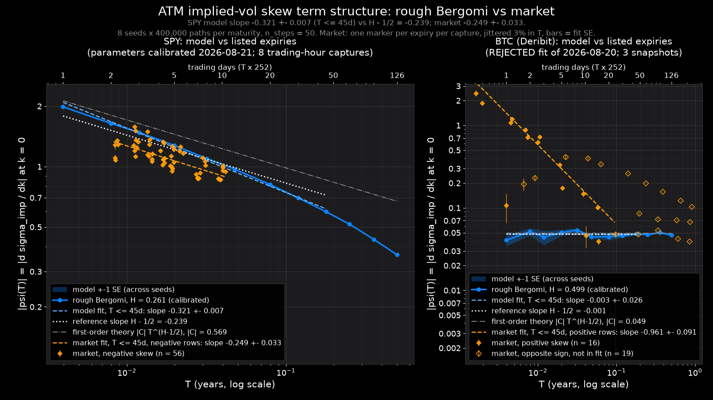

# The rough-volatility signature: ATM skew term structure, model vs market

**Summary.** Under rough Bergomi the at-the-money implied-vol skew
psi(T) = d sigma_imp/dk at k = 0 is predicted to scale like C T^(H - 1/2) at short
maturities, a straight line of slope H - 1/2 on a log-log plot. With the SPY
parameters in `artifacts/rough_calibration.json` (H = 0.2613, so H - 1/2 = -0.239),
the Monte Carlo model gives a skew that is **not a single power law over 1-45 trading
days**: the fitted slope is **-0.321 +- 0.007** (chi^2/dof = 72) and the local exponent
drifts monotonically from **-0.273 +- 0.007 (1-5 d) to -0.457 +- 0.017 (30-126 d)**. The
reason is measured, not guessed: the calibrated vol-of-vol is so large that
eta T^H = 0.93 already at one day, and re-running the same model at eta = 0.5
(eta T^H = 0.12) returns the textbook slope, **-0.233 +- 0.011**, with the fitted amplitude
equal to the first-order prediction (0.0720 vs 0.0723). The SPY market itself, measured
on 8 trading-hour captures x 7 expiries (2-10 trading days), has exponent
**-0.249 +- 0.033**, indistinguishable from H - 1/2 (0.3 sigma) and 1.1-2.1 sigma from the
model's slope over the same window. BTC (Deribit) does not follow a power law at all:
two of three snapshots have a *positive* ATM skew inside two weeks that changes sign
near 15-25 days, and the committed BTC calibration (rejected, H pinned at 0.5) gives a
flat skew of -0.047 that is 5-50x too small at the short end.

Everything below was produced by `python -m scripts.atm_skew_term_structure`
(451 s wall-clock on 16 CPU threads, no GPU). Numbers are in
`docs/atm_skew_term_structure.json`; the figure is `docs/atm_skew_term_structure.png`.

---

## 1. What was computed

### Model side

`backend.quant.rough_vol.rough_bergomi_mc`, unmodified, with the SPY calibration read from
`artifacts/rough_calibration.json`: eta = 3.9352, rho = -0.5363, H = 0.2613,
xi = 0.012773 (sqrt(xi) = 11.30%), rate = 3.713%, spot = 765.74, as of 2026-08-21 11:00
New York. Note the file itself records `accepted: false` ("eta = 3.9352 is pinned at its
bound [0.5, 4]"); the parameters are used because they are what the project carries, and
the consequence of that pinned eta turns out to be the main result.

- Maturity grid: 1, 2, 3, 5, 8, 12, 20, 30, 45, 63, 90, 126 trading days, T = d/252 years,
  n_steps = 50 (project protocol).
- Per maturity, five strikes at log-moneyness k = ln(K/F) in {-2h, -h, 0, +h, +2h} with
  h = max(0.25 sqrt(xi) sqrt(T), 0.002), priced on ONE path set (the engine groups all
  strikes sharing (spot, T, xi, eta, rho, rate) onto common random numbers).
- Prices inverted with `backend.quant.calibrate.implied_vol` on (spot, rate) - the
  engine drifts the spot at `rate` with no dividend, so fwd_pv = spot - and
  psi = (iv(+h) - iv(-h)) / 2h.
- Monte Carlo error: the whole stencil is re-priced on 8 independent seeds x 400,000
  paths; the standard error of psi is the across-seed spread / sqrt(8). Propagating the
  per-strike standard errors as if the +-h prices were independent ("naive" column)
  overstates the error 2.6-2.8x because it ignores the common-random-numbers correlation.
- Truncation of the central difference: the +-2h points give psi_2h on the same paths,
  |psi_h - psi_2h|/3 is the O(h^2) error estimate, and (4 psi_h - psi_2h)/3 is the
  Richardson-extrapolated skew. Both are reported.
- Fit: log|psi| = a + b log T by weighted least squares (weights (|psi|/SE)^2) over
  T <= 45 trading days; the quoted SE on b is the least-squares SE inflated by
  sqrt(chi^2/dof) when chi^2/dof > 1.

### Market side (offline, reproducible)

`backend.quant.calibrate_map.quotes_from_capture` on committed SPY captures under
`data/surfaces/equity/`. The script keeps captures priced on a weekday between 09:35 and
15:55 New York and not flagged stale, and thins them to 8 evenly in time: 2026-08-20 at
13:17, 14:06, 15:15 and 2026-08-21 at 10:15, 11:45, 13:00, 14:30, 15:45 (the archive holds
only these two trading days; the weekend captures are excluded because the book is not
trading while tau keeps ticking). For each capture and each of the 7 listed expiries
(2026-08-24 ... 2026-09-04), a quadratic iv = a + b k + c k^2 is fitted by WLS to the
quoted mid IVs with |k| <= 2 atm_iv sqrt(tau), weights 1/half_spread_iv^2, and its slope
b at k = 0 is psi(tau) with the residual-scaled regression SE. k is measured against the
forward F = fwd_pv e^{r tau}, not against fwd_pv (the difference, r tau = 0.0015 at
tau = 0.04, is comparable to the one-day stencil step). tau is ACT/365 from the pricing
time, the same convention the calibration used for its own Monte Carlo, so model T and
market tau are on the same footing; the top axis "trading days" is simply T x 252.

BTC: `backend.quant.surface.build_surface` on `artifacts/deribit_snapshot_btc_20260805T214815Z.json`
and two archived Deribit surfaces (2026-08-20 17:17Z, 2026-08-21 15:00Z), clean OTM quotes,
mid IV, half the IV bid-ask as the weight, k = ln(K/F) with the per-expiry forward and
r = 0. Model parameters from `artifacts/rough_calibration_btc.json`.

---

## 2. Results: SPY model

Skew on the maturity grid (8 seeds x 400k paths each; SE is across seeds):

| T (days) | h | ATM iv | psi | SE | naive SE | trunc. | Richardson | first-order C T^(H-1/2) |
|---|---|---|---|---|---|---|---|---|
| 1 | 0.0020 | 0.1078 | -1.985 | 0.012 | 0.030 | 0.010 | -1.996 | -2.129 |
| 2 | 0.0025 | 0.1057 | -1.642 | 0.004 | 0.023 | 0.010 | -1.652 | -1.805 |
| 3 | 0.0031 | 0.1042 | -1.482 | 0.004 | 0.018 | 0.012 | -1.494 | -1.638 |
| 5 | 0.0040 | 0.1017 | -1.276 | 0.004 | 0.014 | 0.014 | -1.290 | -1.450 |
| 8 | 0.0050 | 0.0987 | -1.098 | 0.004 | 0.011 | 0.015 | -1.113 | -1.296 |
| 12 | 0.0062 | 0.0959 | -0.971 | 0.004 | 0.009 | 0.017 | -0.988 | -1.177 |
| 20 | 0.0080 | 0.0915 | -0.814 | 0.002 | 0.007 | 0.020 | -0.834 | -1.042 |
| 30 | 0.0097 | 0.0873 | -0.699 | 0.002 | 0.005 | 0.021 | -0.720 | -0.946 |
| 45 | 0.0119 | 0.0825 | -0.596 | 0.002 | 0.004 | 0.022 | -0.618 | -0.858 |
| 63 | 0.0141 | 0.0782 | -0.518 | 0.001 | 0.004 | 0.023 | -0.541 | -0.792 |
| 90 | 0.0169 | 0.0730 | -0.434 | 0.001 | 0.003 | 0.023 | -0.457 | -0.727 |
| 126 | 0.0200 | 0.0677 | -0.363 | 0.001 | 0.003 | 0.022 | -0.386 | -0.671 |

The MC standard error is 0.2-0.6% of |psi|; the central-difference truncation
(0.5% at 1 d, 6% at 126 d) is the larger error beyond 2 days, which is why the
Richardson column exists. (The first-order column is the Bergomi-Guyon leading-order
prediction psi = rho eta sqrt(2H) / (2 (H+1/2)(H+3/2)) T^(H-1/2), C = -0.569; it reduces to
rho eta/4 at H = 1/2. It is reported as the small-eta reference, not as a claim about
BFG's exact constant.)

Power-law fits, log|psi| = a + b log T:

| fit | b | SE(b) | chi^2/dof | n |
|---|---|---|---|---|
| central difference, T <= 45 d | **-0.3210** | 0.0071 | 71.6 | 9 |
| same, truncation added in quadrature to SE | -0.2953 | 0.0076 | 3.0 | 9 |
| Richardson-extrapolated psi, T <= 45 d | -0.3120 | 0.0063 | 58.2 | 9 |
| central difference, all 12 maturities | -0.3545 | 0.0116 | 406 | 12 |
| reference H - 1/2 | -0.2387 | - | - | - |

The chi^2/dof values are the point: with SEs this small, a single straight line does not
describe the curve. Local exponents over sliding windows (central difference):

| window (days) | 1-5 | 2-8 | 3-12 | 5-20 | 8-30 | 12-45 | 20-63 | 30-126 |
|---|---|---|---|---|---|---|---|---|
| b | -0.273 | -0.288 | -0.306 | -0.324 | -0.345 | -0.372 | -0.394 | -0.457 |
| SE | 0.007 | 0.011 | 0.004 | 0.005 | 0.011 | 0.009 | 0.006 | 0.017 |

The slope steepens monotonically with T and only the shortest window approaches
H - 1/2 (and even that is 4.9 SE away). The model amplitude also falls increasingly below
the first-order line: 7% below at 1 day, 30% at 45 days, 46% at 126 days.

### Why: the calibrated eta is far outside the small-vol-of-vol regime

The T^(H-1/2) law is the leading term of an expansion in the effective vol-of-vol
eta T^H. With eta = 3.94 and H = 0.26, eta T^H = **0.93 at one day and 2.51 at 45 days**; the
asymptotic regime (eta T^H << 1) would need T << (1/eta)^(1/H) = 0.005 years, i.e. about a
day. Re-running the model with only eta changed (same H, rho, xi; 8 seeds x 200k paths,
1-45 d):

| eta | eta T^H at 1 d | slope b (T <= 45 d) | Richardson slope | fitted C | first-order C |
|---|---|---|---|---|---|
| 0.5 | 0.118 | **-0.2326 +- 0.0108** | -0.2328 | 0.0720 | 0.0723 |
| 1.5 | 0.354 | -0.2500 +- 0.0035 | -0.2492 | 0.199 | 0.217 |
| 3.9352 (calibrated) | 0.928 | -0.3210 +- 0.0071 | -0.3120 | 0.354 | 0.569 |

At eta = 0.5 the slope agrees with H - 1/2 = -0.2387 to 0.6 SE, every local window is
within about 1 SE of it, and the amplitude matches the first-order coefficient to 0.4%.
The departure at the calibrated parameters is therefore a finite-vol-of-vol effect of the
rough Bergomi model itself, not a numerical artefact: the "rough signature" one would
measure from this calibration over listed maturities is a steeper, curved term structure,
not a straight line of slope H - 1/2.

---

## 3. Results: SPY market

56 (capture, expiry) rows, all with negative skew. psi runs from -1.08 to -1.58 at the
front expiry (tau = 0.0083-0.0113 y, 2.1-2.8 trading days from the pricing time) to
-0.86 to -1.01 at the 2026-09-04 expiry (tau = 0.038-0.041 y). In-band quote counts are
18-80 per expiry; residual RMS about the local quadratic is 0.09-0.50 vol points.

| fit | b | SE(b) | note |
|---|---|---|---|
| pooled, all 56 rows (tau 0.0082-0.0414 y) | **-0.2492** | 0.0332 | LS SE 0.0039, chi^2/dof 71: the scatter across captures, not quote noise, sets the error |
| per-capture exponents (n = 8) | mean -0.266 | sd 0.040 | range -0.332 (08-20 15:15) to -0.210 (08-21 13:00) |
| reference H - 1/2 | -0.2387 | | market - reference = -0.3 sigma |

Per capture: 08-20 13:17 -0.278 +- 0.024; 14:06 -0.311 +- 0.015; 15:15 -0.332 +- 0.020;
08-21 10:15 -0.230 +- 0.049; 11:45 -0.246 +- 0.042; 13:00 -0.210 +- 0.030;
14:30 -0.258 +- 0.045; 15:45 -0.263 +- 0.019. Thursday afternoon's exponent was steeper
than Friday's throughout; the intraday spread (sd 0.040) is larger than any single fit's
SE, so the exponent genuinely moves within a day.

### Model vs market

- **Level.** In the overlapping window the model sits inside the market's intraday range:
  model -1.48 at 3 d vs market -1.08 to -1.58 at 2.1-2.8 d; model -0.97 at 12 d and -1.10 at
  8 d vs market -0.86 to -1.01 at 9.7-10.4 d. This is not an independent test: the
  parameters were calibrated to the 2026-08-21 11:00 surface, which is one of the captures.
- **Slope.** Model -0.321 +- 0.007 (1-45 d) vs market -0.249 +- 0.033: 2.1 sigma apart. Like
  for like, the model's local exponent over 2-8 d is -0.288 +- 0.011 and over 3-12 d is
  -0.306 +- 0.004, i.e. 1.1 and 1.7 sigma from the market. The market's exponent is
  consistent with H - 1/2; the model's, at the calibrated eta, is not (4.5 sigma over 2-8 d,
  11.5 sigma over 1-45 d).

So the market's short-end skew *is* a power law with exponent about -0.25 over the
2-10-day window the archive covers, and the rough Bergomi model with H = 0.26 can put its
level in the right place, but the eta = 3.94 it needed to do so (a fit that ran to its
bound) bends the model's term structure away from the market's. That is consistent with
the calibration's own verdict on itself.

---

## 4. BTC (Deribit): no power law, and a model that cannot see it

Market, 35 rows over three snapshots:

- 2026-08-05 21:48Z: psi = +0.107 +- 0.041 at 1.0 trading-day-equivalent, then negative and
  *steepening* to -0.417 +- 0.026 at 5.8 d and -0.400 +- 0.014 at 10.7 d, then relaxing to
  -0.103 at 223 d. |psi| peaks at 1-2 weeks; the front end is flatter, not steeper.
- 2026-08-20 17:17Z and 2026-08-21 15:00Z: **positive** ATM skew inside two weeks
  (+2.44 +- 0.21 at 0.4 d, +1.08 at 1.1 d, +0.18 at 5.3 d on 08-20; +1.86, +1.20, +0.33 on
  08-21), crossing zero near 15-25 calendar days, then -0.04 to -0.09 from 50 to 213 d.

A log|psi| power law is undefined across a sign change. Inside T <= 45 trading-day
equivalents the majority sign is *positive* (16 rows against 7), so the script's pooled
market fit there runs over the positive-skew rows and excludes the 7 negative ones: the
positive short-end skew decays like T^(-0.96 +- 0.09). That is reported in the JSON for
completeness and is not a rough-volatility exponent; the per-snapshot values (each fitted
on its own majority sign) range from -0.18 to -1.20.

Model, from `artifacts/rough_calibration_btc.json` (eta = 0.5005, rho = -0.393,
H = 0.4994, sqrt(xi) = 39.6%; recorded as rejected: IV RMSE 9.85 vp, H pinned at its upper
bound, eta at its lower bound): psi is flat at -0.041 to -0.054 across 1-126 days, slope
-0.003 +- 0.026 (H - 1/2 = -0.0006), amplitude equal to the first-order value -0.049.
Against the market it is 5x too small at 2 weeks on 08-05 and 25-50x too small (with the
wrong sign) inside a week on 08-20/21. The BTC panel is therefore a negative result on
both sides: the market's short-end skew is not a power law, and the committed parameters
carry no term structure to compare with.

---

## 5. Caveats

1. **Flat forward variance curve.** The model uses xi(t) = xi. Its ATM vol then falls from
   10.8% at 1 d to 6.8% at 126 d (the large eta pulls the ATM vol below sqrt(xi) = 11.3%),
   while the market's ATM vol on 08-20 *rose* from 8.9% at 2.8 d to 12.1% at 10.4 d. A
   term structure of xi would change the level of psi; whether it changes the exponent is
   untested here.
2. **Fixed H, and a rejected calibration.** H = 0.2613 is taken from a fit that pinned eta
   at 4.0 and was rejected by the project's gate. Every model number is conditional on it.
3. **Range of validity of the power law.** The T^(H-1/2) law is asymptotic in eta T^H. At
   the calibrated eta it is never within reach on listed maturities (Section 2); the eta
   scan is the evidence, and it also shows the fitted amplitude drifting from the
   first-order C as eta grows (0.4%, 8%, 38% below it at eta = 0.5, 1.5, 3.94).
4. **MC noise and truncation.** MC SE is <= 0.6% of |psi| everywhere; the central-difference
   truncation (up to 6%) is the larger numerical error and shifts the 1-45-d slope from
   -0.321 (raw) to -0.312 (Richardson). Neither changes any conclusion. n_steps = 50 at every
   maturity is the project protocol; its discretisation error at 126 d (dt = 2.5 days) was
   not studied.
5. **Quote resolution.** ATM half-spreads in the captures are 1-6 vol points; the local
   quadratic averages 18-80 quotes per expiry and its residual RMS is 0.1-0.5 vp, so the
   per-expiry psi SE is 0.006-0.07. The pooled chi^2/dof of 71 says the 56 rows do not share
   one power law at that precision: the exponent varies by +-0.04 within and across the two
   days, and that spread, not quote noise, is the quoted SE.
6. **Short lever arm and few days.** The market window is a factor 5 in tau (2-10 trading
   days) on two consecutive trading days. The model exponent drifts by 0.03 across that
   window, so a market measurement at the 0.01 level would need more days of captures and,
   ideally, weeklies out to 45 days.
7. **Day count.** Market tau is ACT/365 calendar from the pricing time; the model grid is in
   trading days / 252. Both are plotted in years, the convention the calibration used, and
   the exponent is unaffected by a uniform rescaling; a Thursday-to-Monday expiry spans a
   weekend, which is one reason the front-expiry points scatter more.
8. **SPY specifics.** Forwards are backed out of put-call parity, expiries spanning an
   ex-dividend date are dropped upstream, and mids are yfinance book mids.

## 6. What would falsify these claims

- *"The calibrated rough Bergomi skew is not a straight line of slope H - 1/2, because
  eta T^H is not small."* Falsified if a run at eta = 0.5 returned a T <= 45-d slope more
  than 3 SE from -0.239, or if the local exponents at eta = 3.94 did not drift
  monotonically with T. Measured: -0.233 +- 0.011 at eta = 0.5; drift from -0.273 to -0.457.
- *"The SPY market's 2-10-day ATM skew is a power law with exponent about -0.25, consistent
  with H - 1/2 = -0.239."* Falsified by captures on other days with pooled exponents outside
  about [-0.35, -0.15], or by a longer-expiry window (10-60 d) with a materially different
  slope. Untested beyond 2026-08-20/21.
- *"Model and market slopes differ."* Only at 1.1-2.1 sigma over the common window; a
  market SE near 0.01 (more days) would settle it either way.
- *"BTC's short-end ATM skew has no power law."* Falsified if snapshots on other days show
  a single-signed, monotone |psi| inside 30 days. Three snapshots, two with a sign change,
  is what is in hand.

Reproduce: `python -m scripts.atm_skew_term_structure` (matplotlib from
`requirements-dev.txt`); `--quick` for a 20-s smoke run; `--figure-only` redraws the PNG
from the JSON. Tests: `tests/test_atm_skew.py` (6 tests, about 13 s).
