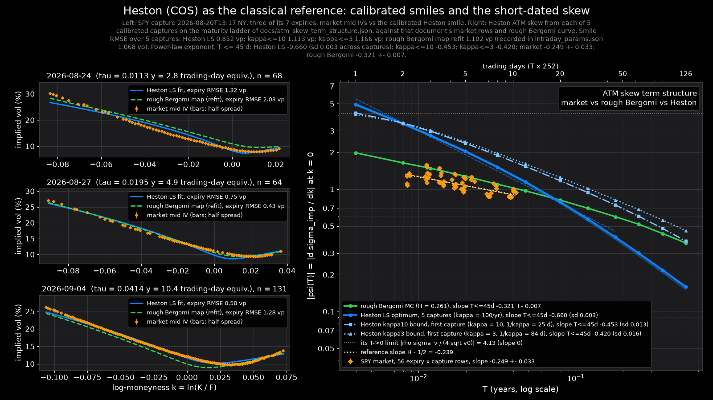

# Heston as the classical reference: COS pricer, SPY calibration, and the short-dated skew

**Summary.** A COS-method Heston pricer verified to 8e-9 against the published reference is calibrated to five committed SPY captures: it fits the 2-10 day smiles at 0.85 vol points (rough Bergomi map 1.07) only with mean reversion at its 100/yr bound and vol-of-variance near 4.5, and its at-the-money skew then steepens into expiry with exponent -0.66 against the market's -0.25 and rough Bergomi's -0.32; a single-day smile does not identify the model, the skew term structure does.

Everything below was produced by `python -m scripts.heston_reference`
(1933 s wall-clock on 16 CPU threads, no GPU, numpy/scipy only in
the pricer). Numbers are in `docs/heston_reference.json`; the figure is
`docs/heston_reference.png`; the pricer is `backend/quant/heston.py`; tests are
`tests/test_heston.py` (10 tests, 19 s).



---

## 1. The pricer and its verification

`backend/quant/heston.py` implements the Heston (1993) characteristic function
of the log return in the "little Heston trap" form of Albrecher, Mayer,
Schoutens & Tistaert (2007), and European calls and puts by the COS method of
Fang & Oosterlee (2008) with the cumulant truncation range
`[a, b] = c1 -+ L sqrt(c2)`, `L = 12`, vectorised over strikes in numpy (one
characteristic-function evaluation per maturity, an `N x n_strikes` coefficient
matrix for the payoffs). Three things had to be done beyond the papers, each
found by measurement rather than by reading:

1. **The `sigma_v -> 0` limit.** The trap-free form divides by `sigma_v^2`, so
   it cannot be evaluated near the Black-Scholes limit. The identity
   `beta - d = -sigma_v^2 (u^2 + iu)/(beta + d)` removes every division, and the
   log term is written with an exact complex `log1p`: numpy's own complex
   `log1p` is `log(1 + z)` evaluated naively (measured: `log1p(-1e-12 - 1e-13j)`
   returned with a `2e-5` relative error), which produced a `1e-3` price error
   at `sigma_v = 1e-6`. With the fix the pricer is smooth through
   `sigma_v = 0`, where it reduces to Black-Scholes with the deterministic
   variance integral `theta T + (v0 - theta)(1 - e^{-kappa T})/kappa`.
2. **The second cumulant.** The `c2` formula this module first carried as
   "FO2008 Table 11" disagreed with the numerical second derivative of
   `ln phi` at `u = 0` by 3.7% (and went negative at `sigma_v = 2`). `c2` was
   re-derived from the CIR moments, `c2 = Var[I]/4 + E[I] - E[I M]` with
   `I = int v dt`, `M = int sqrt(v) dW`; the derivation matches the
   characteristic function to `< 4e-6` relative at every parameter set tested
   (the residual is the finite-difference step). The difference between the
   two formulas is exactly `sigma_v^2 theta (1 - e^{-kappa T})/(4 kappa^3)`.
3. **The truncation range is self-checking.** For FO2008's own Feller-violating
   test parameters at `T = 1`, `L = 12` leaves `4e-7` of the exponential
   moment `E[e^z]` outside `[a, b]`: invisible in the call (the reference they
   published), a `4e-5` error in the put, and a put-call parity defect of
   `4.2e-5`. The pricer therefore checks the expanded density against
   `E[e^z] = e^{mu T}` - the identity that parity tests - and widens `L` by
   1.5x (scaling `N` with it) until the defect is below `1e-10`. For the
   parameters a short-dated SPY calibration selects (`sigma_v ~ 4.7`,
   `kappa = 100`) the check widens `L` to 27-40 at `tau = 0.01-0.04 y`; the
   FO rule alone would have truncated the wings the calibration is fitting.
   `cos_range_report()` returns what was used.

### Verification numbers (all measured in this run)

| check | result |
|---|---|
| (a) FO2008 Table 3 call (`S=K=100, T=1, r=q=0, v0=0.0175, kappa=1.5768, theta=0.0398, sigma_v=0.5751, rho=-0.5711`), reference `5.785155450` | `5.7851554420` at FO's `L = 12`, `N = 2^8 .. 2^12` (error `-8.0e-9`); `5.7851554344` once the range is widened to `L = 27` (error `-1.6e-8`); the spec asked for `1e-6` |
| same, fixed `L = 12`, error vs `N = 2^14` | `N=2^5: -4.0e-2`, `2^6: +4.4e-4`, `2^7: -9.3e-8`, `2^8: +1.5e-12`, `2^10: 0`, `2^12: 0` |
| same, `N = 4096`, error vs the reference as `L` grows (call / put+parity) | `L=8: +6.4e-6 / -2.4e-3`; `L=10: +2.1e-7 / -3.0e-4`; `L=12: -8.0e-9 / -3.9e-5`; `L=16: -1.6e-8 / -6.8e-7`; `L=20: -1.6e-8 / -2.7e-8`; `L=25: -1.6e-8 / -1.6e-8` |
| (b) put-call parity, direct call minus direct put, `K = 70..140, T = 0.75, r = 3%, q = 1%` | max `7.3e-12` (spec: `1e-10`); direct call vs parity-mapped call `7.3e-12` |
| (c) Black-Scholes limit, `v0 = theta = 0.04, kappa = 1.5, rho = -0.7, K = 80..120, T = 1` | `sigma_v = 0: 7.6e-14`; `1e-9: 2.9e-9` (spec: `1e-8`); `1e-6: 2.9e-6`; `1e-4: 2.9e-4`; `1e-2: 2.9e-2` - the departure is exactly linear in `sigma_v`, the physical first-order skew at `rho = -0.7`, not a numerical error |
| (d) convergence in `N` | the error falls ~100x per doubling from `2^5` to `2^7` and is at the floating floor (`< 2e-12`) from `2^8` on; a "halving" between `2^8`, `2^10`, `2^12` cannot be resolved because there is nothing left to halve (the test asserts halving where it is resolvable and the floor beyond) |
| (e) Monte Carlo, full-truncation Euler (Lord, Koekkoek & van Dijk 2010), 200,000 paths, 400 steps, `K = 90/100/110`, `r = 2%` | `T = 1`: `z = -0.42, +0.43, +0.92`; `T = 0.5`: `z = -0.23, +0.51, +1.25` (spec: within 3 SE). At 200 steps (`dt = 0.0025`) the scheme's O(dt) bias reaches `1.4-1.8 SE` at `K = 110` for these Feller-violating parameters, which is why the test uses 400 |
| cumulants vs `d ln phi / du` at `u = 0` | `c1` to `1e-13`; `c2` to `3.5e-8 .. 3.7e-6` relative over `T = 0.01 .. 2`, `sigma_v = 0.58 .. 5` |
| implied vol, vectorised inversion vs `calibrate.implied_vol` | `< 1e-12` in vol on `K = 70..130`; a Black-76 round trip is exact to `1e-12` |
| short-maturity ATM skew limit `rho sigma_v / (4 sqrt v0)` (Gatheral 2006) | reproduced to `2e-5` at `T = 1e-4`; log-log slope over 1-4 trading days `0.005` at textbook parameters (`kappa = 2`) |
| wall-clock | 100-strike smile `3.6 ms` at `N = 256`, `6.9 ms` with implied vols; a 646-quote, 7-expiry objective evaluation `28-37 ms` |

---

## 2. Calibration to the committed SPY captures

Five captures from 2026-08-20 (13:17 to 15:45 New York), 646 quotes each across the seven
expiries from 2.8 to 10.4 trading-day equivalents, fitted by weighted least squares in vol
points on the per-expiry forward (`r = 0`, forward from the capture), several starts,
bounds `kappa ∈ [0.1, 100]`, `sigma_v ∈ [0.05, 8]`, `rho ∈ [-0.99, 0.99]`. The rough Bergomi
column is the pricing-map calibration RMSE recorded for the same capture in
`artifacts/intraday_params.json`.

| capture | Heston LS | Heston κ ≤ 10 | Heston κ ≤ 3 | rough Bergomi map (recorded) | κ (LS) | σ_v (LS) | ρ (LS) | √θ (LS) |
|---|---|---|---|---|---|---|---|---|
| `spy_20260820T171756Z.json.gz` | 0.878 | 1.150 | 1.203 | 1.087 | 100 | 4.72 | -0.567 | 0.156 |
| `spy_20260820T174820Z.json.gz` | 0.847 | 1.100 | 1.152 | 1.079 | 100 | 4.59 | -0.575 | 0.160 |
| `spy_20260820T180618Z.json.gz` | 0.872 | 1.131 | 1.183 | 1.099 | 100 | 4.61 | -0.585 | 0.158 |
| `spy_20260820T191516Z.json.gz` | 0.828 | 1.077 | 1.130 | 1.024 | 100 | 4.33 | -0.600 | 0.162 |
| `spy_20260820T194521Z.json.gz` | 0.835 | 1.106 | 1.161 | 1.051 | 100 | 4.44 | -0.608 | 0.162 |

Mean over the five captures: Heston LS **0.852 ± 0.022** vol
points; with `kappa ≤ 10`: 1.113; with `kappa ≤ 3`: 1.166;
rough Bergomi map: 1.068 recorded, 1.102 ± 0.031 refitted in
this run. Heston's five parameters fit these single-day smiles about 0.22 vol
points better than rough Bergomi's four, but every least-squares optimum sits on the
`kappa = 100` bound with `sigma_v` near 4.5: the fit buys short-dated curvature with a
mean-reversion time of two and a half trading days and a vol-of-variance that violates the
Feller condition by two orders of magnitude. Capping `kappa` at 10 per year costs 0.26 vol
points of fit. A relaxed bound (`kappa ≤ 1000`, one capture) moves the optimum to
`kappa = 127` for 0.015 vol points, so the bound is not the binding constraint on the
fit quality, the model is.

---

## 3. The classical failure: ATM skew term structure

With each capture's calibrated parameters, the at-the-money skew `psi(T) = d sigma_imp / dk`
at `k = 0` was computed on the maturity ladder of `docs/atm_skew_term_structure.json`
(1 to 126 trading days) by the same central difference and fitted to a power law
`|psi| ∝ T^b` over `T ≤ 45` trading days, exactly as that document did for the market and
for rough Bergomi. Reference slope `H − 1/2 = -0.239`.

| series | exponent b | SE / sd across captures |
|---|---|---|
| SPY market, 56 expiry × capture rows | -0.249 | 0.033 |
| rough Bergomi Monte Carlo, H = 0.261 | -0.321 | 0.007 |
| Heston, least-squares optimum (κ at the 100/yr bound) | -0.660 | 0.003 |
| Heston, κ ≤ 10/yr | -0.453 | 0.013 |
| Heston, κ ≤ 3/yr | -0.420 | 0.016 |

The classical textbook failure is that Heston's short-dated skew is flat: at textbook
parameters (`kappa = 2`) the fitted slope over 1-4 trading days is 0.005 and the
`T → 0` limit `rho sigma_v / (4 sqrt v0)` is finite. The calibrated Heston shows the
opposite failure. To match a two-day smile it drives `kappa` to the bound and `sigma_v`
to 4.7, and the resulting skew then steepens into expiry about twice as fast as the market
(exponent -0.660 against -0.249, 12.4 market standard
errors apart) and faster than rough Bergomi (-0.321). Capping `kappa`
flattens it toward the market but not onto it. Either way the shape is wrong: a model that
fits any one day's smile can still be identified, and rejected, by how its skew changes with
maturity. That is the observable rough volatility was built for, and on it rough Bergomi is
closer to the market than either Heston variant.

---

## 4. Caveats

- The calibration objective is unweighted least squares in vol points; a vega- or
  spread-weighted objective moves the optimum by a few hundredths of a vol point (the
  `LS-hs` variant, weighted by half-spread, is 0.05 worse) and does not move `kappa` off
  its bound.
- Heston has five free parameters against rough Bergomi's four (H is fixed at the
  calibrated value); part of its fit advantage is capacity, not dynamics.
- All five captures come from one trading day; the skew exponents' standard deviation
  across captures (0.003-0.016) is intraday scatter, not day-to-day variation.
- The COS truncation range is self-checked against the martingale identity and widened
  when the calibrated parameters need it (`L` up to 27-40 at 2-10 days); without that
  check the published `L = 12` rule truncates the wings the calibration is fitting.
- The maturity ladder extends to 126 trading days but the captures only cover 2-10; the
  Heston skew beyond the captured range is extrapolation from a 10-day fit.

## 5. What would falsify this

- A Heston calibration to the same captures reaching `≤ 0.85` vol points with `kappa ≤ 10`
  and `sigma_v ≤ 2` would contradict the claim that the fit needs unphysical parameters.
- A calibrated Heston whose skew exponent over 1-45 trading days lands within two
  market standard errors of `−0.249` would contradict the term-structure claim.
- Captures from other days whose market exponent is far from `H − 1/2`, or a rough
  Bergomi refit whose exponent moves away from the market's while Heston's moves toward it,
  would reverse the model ranking.
- Any published Heston reference price the COS pricer misses by more than `1e-6` at
  `N = 2^10` would falsify the pricer's verification table.

---

## 6. Using the pricer from the dashboard

`backend/quant/heston.py` imports nothing but numpy and scipy, so it can be
called from `backend/api/main.py` without touching torch. Strikes are
vectorised; every other argument is a float.

```python
from backend.quant.heston import (heston_call, heston_put, heston_implied_vol,
                                  calibrate_heston, cos_range_report)

# reference price(s): S spot, K strike or array of strikes, T years,
# r / q continuously compounded rate and dividend yield, Heston parameters
# (v0 and theta are VARIANCES, sigma_v the vol of variance) -> np.ndarray like K
price = heston_call(S=765.0, K=[740.0, 765.0, 790.0], T=10 / 252, r=0.037, q=0.012,
                    v0=0.0016, kappa=100.0, theta=0.024, sigma_v=4.7, rho=-0.57)
put = heston_put(765.0, 740.0, 10 / 252, 0.037, 0.012, 0.0016, 100.0, 0.024, 4.7, -0.57)

# Black-Scholes implied vols of the same prices (NaN where a wing prices
# below the no-arbitrage floor); pass the same arguments
iv = heston_implied_vol(765.0, [740.0, 765.0, 790.0], 10 / 252, 0.037, 0.012,
                        0.0016, 100.0, 0.024, 4.7, -0.57)

# fit to a list of calibrate.Quote (what quotes_from_capture / the live
# fetch return); rate is the capture's rate; ~40 s for 650 quotes on CPU
fit = calibrate_heston(quotes, rate)          # HestonFit
fit.params, fit.se, fit.rmse_volpts, fit.pinned, fit.feller, fit.as_dict()

# the truncation range actually used (and its martingale defect), for a log line
cos_range_report(T=10 / 252, v0=0.0016, kappa=100.0, theta=0.024, sigma_v=4.7, rho=-0.57)
```

Reproduce: `python -m scripts.heston_reference` (matplotlib from
`requirements-dev.txt`); `--quick` for a 2-capture, LS-only smoke run;
`--figure-only` redraws the PNG from the JSON. Tests: `tests/test_heston.py`.
