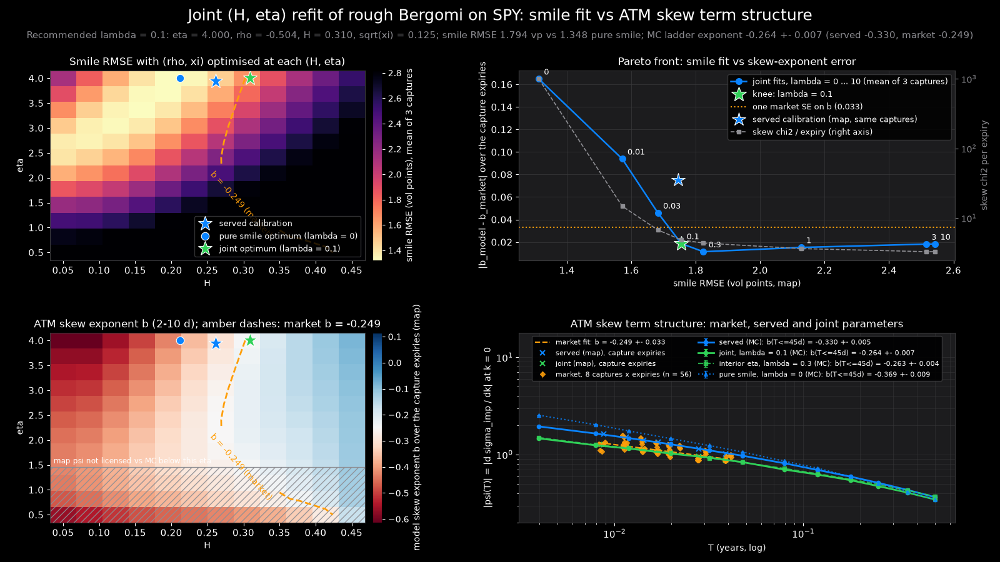

# Joint (H, η) refit of rough Bergomi against the smiles and the ATM skew term structure

**Summary.** The latest SPY smile calibration, `artifacts/rough_calibration.json` (η 3.94 at its
bound, ρ −0.54, H 0.26; marked not accepted by its own quality gate), fits single-day
smiles well but its at-the-money skew steepens into expiry with exponent −0.33 (Monte Carlo,
1–45 trading days), 2.5 market standard errors away from the market's −0.249 ± 0.033. Adding the
skew term structure to the calibration objective moves the optimum to **H 0.31, ρ −0.50,
√ξ 12.5 %** (η at the calibrator's 4.0 bound) and puts the Monte Carlo exponent at
**−0.264 ± 0.007**, within half a market standard error, for a cost of **0.45 vol points** of
smile RMSE (1.31 → 1.76, pricing-map RMSE, mean of three captures). An interior-η solution
(η 3.39, H 0.30) reaches the same exponent (−0.263 ± 0.004) for about 0.15 vol points more.
That 4.0 is the optimiser's bound, not the map's: the committed pricing map is trained over
`η ∈ [0.5, 8.0]`, and with η free to 8 on that same map the knee lands interior on all three
captures (η 4.74, 5.87, 7.00; H 0.33–0.38) for 0.08–0.19 vol points less smile RMSE and an
exponent still inside one market standard error, so **H 0.31 is the value the calibrator's box
selects** (§3.5). The recommended parameters are written to
`artifacts/rough_calibration_skewjoint.json` as an analysis artifact; the calibration files and
the served 0DTE surrogate are unchanged. The served surrogate was trained on an earlier fit that
the quality gate accepted (20 August 2026: η 3.66, ρ −0.63, H 0.255), not on the calibration file
compared against below.

Everything below was produced by `scripts/joint_skew_refit.py` (staged and resumable: 680 s of
wall-clock on 16 CPU threads for §§3.1–3.4 and a further 640 s for §3.5, no GPU; every stage
checkpoints to JSON). Every number below is in `docs/joint_skew_refit.json`: §§3.1–3.4 in the
blocks named after their stages, §3.5 under `eta_extension`, which is the `eta-extend` stage's own
checkpoint copied in verbatim by `python -m scripts.joint_skew_refit report`. The figure is
`docs/joint_skew_refit.png`; tests are `tests/test_joint_skew_refit.py` (13 tests).

---

## 1. Question

`docs/atm_skew_term_structure.md` established two things: the SPY market's ATM skew
`ψ(T) = dσ_imp/dk` at `k = 0` steepens toward expiry with exponent `b = −0.249 ± 0.033`,
consistent with the rough-volatility prediction `H − ½ = −0.239` at the calibration file's `H = 0.261`;
and the model at those parameters does not reproduce that law, because its vol-of-vol sits at the
`η = 4` bound where `η T^H` is order one even at one day, giving `b = −0.321 ± 0.007`. The smile
calibration never sees the term structure explicitly: it minimises a vega-weighted Huber loss over
quotes, and the cheapest way to buy short-dated curvature is more `η`. This document asks whether a
joint fit of `(H, η)` (with `ρ` and `ξ` free) exists that matches the smiles acceptably *and* the
market's skew term structure, and what it costs.

## 2. Method

- **Smile objective**: `MapCalibrator.loss` from `backend/quant/calibrate_map.py` (vega-weighted
  Huber in implied-vol space, evaluated by the neural pricing map `artifacts/pricing_map.pt`), on
  three trading-hour captures: `spy_20260820T171756Z`, `spy_20260821T150017Z`,
  `spy_20260821T194519Z` (585–646 quotes each, seven expiries from 2.2 to 10.4 trading-day
  equivalents).
- **Skew objective**: for each capture and expiry, the market ATM skew `ψ_mkt(τ)` and its standard
  error from `market_skew_from_quotes` (local quadratic in `k` near the money), and the model's
  `ψ(τ)` from the pricing map by a central difference in log-moneyness (step `h ∝ σ_ATM √τ`, floor
  0.002, inside the map's box). The joint objective is
  `J(θ) = smile loss + λ · (1/n_exp) Σ_expiries ((ψ_model − ψ_mkt)/SE_mkt)²`.
- **Licensing the map**: the map-based `ψ` was checked against `model_skew_curve` (rough Bergomi
  Monte Carlo, 4 × 200k paths) on the capture expiries across the `(H, η)` grid. Relative RMS
  agreement is 1.9 % at `η = 1.45` and above, and breaks down at `η = 0.5` (24 %, the map is not
  trained to resolve the skew there). Cells with `η < 1.45` are shown hatched in the profile and
  excluded from conclusions.
- **Profile**: 12 × 12 grid over `H ∈ [0.05, 0.45]`, `η ∈ [0.5, 4.0]`; at each cell `(ρ, ξ)` are
  optimised on the smile objective (Powell, warm-started across the grid), recording smile RMSE,
  model exponent over the capture expiries and skew χ² per expiry.
- **`η` above the calibration bound**: the 4.0 ceiling is `BOUNDS["eta"]` in
  `backend/quant/calibrate.py`, not a limit of the map — `artifacts/pricing_map.pt` records the
  training box `η ∈ [0.5, 8.0]` in its own metadata (`scripts/gen_pricing_map.py`'s `BOX`), and the
  same map is fitted with `η` free to 8 on the BTC path (`calibrate_map.ETA_MAX`). The profile
  strip (`H` grid × `η ∈ [4, 8]` in steps of 0.5) and the four-parameter fits are therefore
  repeated with `η` free to 8, beside the same fits capped at 4, on the same captures, the same
  map and the same seed: `python -m scripts.joint_skew_refit eta-extend`. Because the map carries
  no licence above `η = 4`, both ends of each pair are then priced by the Monte Carlo engine on
  `spy_20260821T150017Z` — the skew curve on its seven expiries at 4 × 200k paths, and a
  400,000-path repricing of all 585 of its quotes. §3.5.
- **Joint fits**: a full four-parameter optimisation (differential evolution + Powell, as
  `MapCalibrator`) for `λ ∈ {0, 0.01, 0.03, 0.1, 0.3, 1, 3, 10}`, per capture and averaged; the
  Pareto front of smile RMSE against `|b_model − b_mkt|` picks the knee.
- **Uncertainty**: 24 bootstrap refits (quotes resampled by expiry) at the recommended `λ`.
- **Monte Carlo validation**: the calibration-file, pure-smile, joint and interior-η parameters on the
  standard maturity ladder (1–126 trading days, 4 × 200k paths, common random numbers across the
  strike stencil) for the exponent over `T ≤ 45` days, and a 400,000-path repricing of one capture's
  585 quotes for the smile RMSE with the true engine.

## 3. Results

### 3.1 Profile

Smile RMSE is flattest along a ridge from `(H 0.2, η 4)` down toward `(H 0.35, η 2)`; the market
exponent contour `b = −0.249` runs almost vertically at `H ≈ 0.30–0.32` for every `η ≥ 1.5`. The
two do not cross at the smile optimum, which is why the pure-smile calibration cannot reproduce the
term structure: the model's exponent on the capture expiries is `−0.41` there.

### 3.2 Pareto front (mean over the three captures, pricing map)

| λ | smile RMSE (vol pts) | model exponent b (capture expiries) | skew χ² / expiry | η | ρ | H | √ξ |
|---|---|---|---|---|---|---|---|
| 0 (pure smile) | 1.312 | −0.414 | 996 | 3.90 | −0.551 | 0.200 | 0.119 |
| 0.01 | 1.572 | −0.343 | 14.8 | 4.00 | −0.452 | 0.257 | 0.123 |
| 0.03 | 1.682 | −0.295 | 6.7 | 4.00 | −0.481 | 0.283 | 0.124 |
| **0.1 (knee)** | **1.755** | **−0.268** | **4.8** | 4.00 | −0.502 | 0.299 | 0.125 |
| 0.3 | 1.82 | −0.26 | 4.4 | interior on two captures | | | |
| 1 – 10 | 2.1 – 2.5 | −0.26 to −0.27 | 3.3 – 3.6 | interior on two or three | | | |

The calibration file on the same captures: smile RMSE 1.745 ± 0.113, exponent −0.324 ± 0.005,
χ² 266 ± 157 per expiry. The knee at `λ = 0.1` sits inside one market standard error of the
market exponent at less than half the calibration file's skew χ², and costs 0.44 vol points
against the pure-smile optimum.

### 3.3 Recommended parameters (λ = 0.1, capture `spy_20260821T150017Z`)

| parameter | joint refit | bootstrap (24 resamples) | calibration file | pure smile |
|---|---|---|---|---|
| η | 4.000 (bound) | 3.99 ± 0.02, interior in 4 % of resamples | 3.935 | 4.000 |
| ρ | −0.504 | −0.503 ± 0.019 | −0.536 | −0.539 |
| H | 0.310 | 0.308 ± 0.011 | 0.261 | 0.212 |
| √ξ | 0.1253 | 0.1254 ± 0.0008 | 0.1130 | 0.1187 |
| smile RMSE, map (vol pts) | 1.794 | 1.80 ± 0.06 | 1.655 | 1.348 |
| smile RMSE, MC 400k paths (vol pts) | 2.12 | | 1.91 | 1.53 |
| skew χ² / expiry, map / MC | 7.9 / 8.9 | 8.4 ± 2.6 | 301 / 330 | 960 / 1058 |
| exponent, capture expiries, map / MC | −0.251 / −0.233 ± 0.008 | −0.253 ± 0.018 | −0.322 / −0.297 ± 0.007 | −0.400 / −0.355 ± 0.005 |
| **exponent, ladder 1–45 d, MC** | **−0.264 ± 0.007** | | −0.330 ± 0.005 | −0.369 ± 0.009 |

Market: exponent −0.249 ± 0.033 (56 rows over eight captures, 2–10 trading days); on this
capture's own seven expiries −0.245 ± 0.035. The joint parameters are 0.5 SE from the pooled
market exponent; the calibration file is 2.5 SE away and the pure-smile optimum 3.6 SE. That
± 0.033 is the fit error of one regime's pooled rows: the per-capture exponent itself moves with
sd 0.040 across the eight captures (`docs/atm_skew_term_structure.md`), so those counts rank the
parameter sets against one market estimate rather than measure how far each sits from the market.

Interior-η alternative (`λ = 0.3`, `η 3.39, ρ −0.551, H 0.295, √ξ 0.1265` on this capture):
ladder exponent −0.263 ± 0.004, skew χ² 6.9 map / 8.2 MC per expiry, map smile RMSE 1.93
(MC 2.26). It reproduces the term structure equally well with `η` off its bound, for a further
0.15 vol points of smile fit on the three-capture mean (1.755 → 1.910).

### 3.4 The pricing map versus the true engine

Repricing the 585 quotes of one capture with 400,000 paths, the map's smile RMSE is below the Monte
Carlo one by 0.25–0.35 vol points for every parameter set (calibration file 1.65 vs 1.91, joint 1.79 vs 2.12,
pure 1.35 vs 1.53, interior 1.93 vs 2.26); about 0.65 vol points of the Monte Carlo figure is its own
noise floor at this path count, so the map is neither systematically optimistic nor pessimistic
about the *ranking*, which the Monte Carlo reproduces. The map's skews agree with Monte Carlo to
1–3 % on the capture expiries for all four parameter sets; the map exponents are 0.02–0.04 steeper
than the Monte Carlo ones, a bias that is the same for every set and does not change the conclusion.

### 3.5 `η` above the calibration bound

The 4.0 ceiling is the calibrator's, not the map's: `BOUNDS["eta"]` in `backend/quant/calibrate.py`
stops the optimiser at 4, while the committed map carries the training box `η ∈ [0.5, 8.0]` in its
own metadata and is fitted with `η` free to 8 on the BTC path. Re-running the strip and the
four-parameter fits with `η` free to 8 costs 640 s on 16 CPU threads and regenerates nothing; the
arm capped at 4 reproduces §3.2's `λ = 0.1` row and §3.3's fit to the precision they are quoted at
(`η 4.000, ρ −0.504, H 0.310, √ξ 0.1253`, smile RMSE 1.794, χ² 7.9), which is what licenses reading
the extended arm beside them.

**The smiles do not identify `η`.** Every `η` between 4 and 8 has an `H` that fits them as well as
any other. The strip runs `η` from 4 to 8 in steps of 0.5; the integer columns on
`spy_20260821T150017Z`, best cell of each, `(ρ, ξ)` optimised as in §3.1:

| η | H | smile RMSE (vol pts) | model exponent b | skew χ² / expiry |
|---|---|---|---|---|
| 4.0 | 0.195 | 1.355 | −0.430 | 953 |
| 5.0 | 0.268 | 1.343 | −0.359 | 934 |
| 6.0 | 0.305 | 1.347 | −0.341 | 904 |
| 7.0 | 0.377 | 1.346 | −0.238 | 867 |
| 8.0 | 0.414 | 1.340 | −0.209 | 834 |

Across the whole strip the smile RMSE moves by 0.03 vol points, 1.355 at the bound to 1.326 at
`η 7.5` — a tenth of the map's own offset from the true engine (§3.4) — while `H` doubles and the
exponent travels from −0.430 to −0.209, straight through the market's −0.249. So the pure-smile fit
runs to whichever ceiling it is given: `η 4.000, H 0.212` capped, `η 8.000, H 0.400` free, for
0.02 vol points of map smile RMSE (1.348 → 1.326); on `spy_20260821T194519Z` the same,
`η 4.000, H 0.195` against `η 8.000, H 0.386` (1.467 → 1.450); on `spy_20260820T171756Z` the
smile optimum is interior at `η 3.70` either way.
What the ridge does not buy is the *level* of the skew: at `η 8, H 0.400` the model's `ψ` is still
24–41 % steeper than the market's at every expiry and its skew χ² is 853 per expiry, against 960
at the bound. The exponent can be had from `η` alone; the term structure cannot.

**The true engine does not pay for the extra `η`.** Repricing all 585 quotes of
`spy_20260821T150017Z` at 400,000 paths ranks the capped pure-smile optimum ahead of the free one:
1.53 vol points at `η 4.000, H 0.212` against 1.55 at `η 8.000, H 0.400`, and 1.34 against 1.44 on
the 301 quotes inside `z = |k| / (σ_ATM √τ) < 2`, where the Monte Carlo inversion is stable and
both path seeds separate the two cleanly. The map's 0.02 vol points of gain is an order of
magnitude inside its own offset from the engine (§3.4): the ridge is flat in `η`, and what tilt
the engine does see runs the other way. The map is licensed to be read along it: at both extended
optima its `ψ` matches the Monte Carlo one to 1.0–1.2 % relative RMS on the capture expiries —
closer than the 1.9 % the profile is licensed by (§2) — with exponents −0.235 against
−0.230 ± 0.008 at `η 8, H 0.400`, and −0.241 against −0.229 ± 0.008 at `η 4.744, H 0.334`.

**The knee moves off the bound.** At `λ = 0.1`, where the ceiling does bind, freeing `η` lowers the
joint objective on all three captures — the smile term gains more than the skew term gives back:

| capture | η | H | smile RMSE | b (capture expiries) | χ² / expiry | J |
|---|---|---|---|---|---|---|
| 08-20 17:17, capped | 4.000 | 0.287 | 1.559 | −0.286 | 3.3 | 1.469 |
| 08-20 17:17, free | 7.004 | 0.380 | 1.365 | −0.263 | 4.0 | 1.314 |
| 08-21 15:00, capped | 4.000 | 0.310 | 1.794 | −0.251 | 7.9 | 2.185 |
| 08-21 15:00, free | 4.744 | 0.334 | 1.711 | −0.242 | 8.7 | 2.161 |
| 08-21 19:45, capped | 4.000 | 0.302 | 1.912 | −0.266 | 3.3 | 1.877 |
| 08-21 19:45, free | 5.872 | 0.360 | 1.737 | −0.246 | 4.8 | 1.794 |

`η` lands interior on every capture (4.74, 5.87, 7.00) and 0.08–0.19 vol points of smile RMSE are
recovered, for a skew χ² 0.7–1.5 larger; the exponent stays within one market standard error of
−0.249 throughout (−0.263, −0.242, −0.246 against ± 0.033). Here the Monte Carlo agrees with the
map: on `spy_20260821T150017Z` the 400,000-path repricing falls from 2.12 vol points at the bound
to 2.01 with `η` free, and from 1.64 to 1.60 inside `z < 2`. The direction of §3.3 survives — the
term structure still wants a larger `H` than the smiles alone — but how far `H` travels is set by
the ceiling: 0.31 with `η` capped at 4, 0.33–0.38 with `η` free to 8. `H 0.310` is therefore a
statement about the calibrator's box as much as about the data.

## 4. What it means for the served models

- `artifacts/rough_calibration.json` is left as it is: it is what the 0DTE surrogate
  (`artifacts/model_0dte.pt`) was trained on, and the surrogate's box, labels and ensemble all
  assume those dynamics. Adopting the joint parameters means regenerating the 0DTE labels
  (`backend/quant/dataset_0dte.py`) and retraining (`backend/quant/train_0dte.py`), a GPU job;
  this document recommends it and does not do it.
- The skew term structure pulls `H` in one direction: up. At the knee it is 0.310, against the
  calibration file's 0.261 and the served checkpoint's 0.255. The ± 0.011 across the 24 bootstrap
  resamples is the spread of one afternoon's quote sample, not of the market, so it does not
  license a sigma count: the per-capture exponent itself moves with sd 0.040 over the eight
  captures (`docs/atm_skew_term_structure.md`), and the market target −0.249 ± 0.033 is
  `H = b + ½ = 0.251 ± 0.033`, an interval spanning 0.18–0.32 at two standard errors — wide
  enough to contain 0.255, 0.261 and 0.310 alike. What the comparison supports is a direction and
  a price: fitting the term structure as well as the smiles moves `H` up by about 0.05 and costs
  about 0.45 vol points of smile RMSE, on two trading days of one regime.
- The three captures come from two consecutive trading days; the term-structure target is
  therefore the same regime three times, not three independent days.

## 5. Caveats

- The market skew is measured over 2–10 trading days and the model exponent over 1–45; the model's
  local exponent drifts (−0.22 over 1–5 d to −0.32 over 12–45 d for the joint parameters), so the
  window matters and is stated with every number.
- The profile and the joint fits use the pricing map, licensed against Monte Carlo over
  `1.45 ≤ η ≤ 4`; nothing below that is claimed. Above 4 the licence is §3.5's own Monte Carlo
  check at the two extended optima, where the map's `ψ` matches to 1.0–1.2 % relative RMS — two
  points on one capture, not a grid.
- The recommended `η` is at 4.0 because `BOUNDS["eta"]` in `backend/quant/calibrate.py` stops the
  optimiser there, not because the objective has a minimum there. The committed map's own box runs
  to `η = 8`, and with `η` free to it the knee moves interior — `η 4.74, H 0.334` on
  `spy_20260821T150017Z`, `η 5.87` and `η 7.00` on the other two — for 0.08–0.19 vol points less
  smile RMSE and a skew χ² 0.7–1.5 larger (§3.5). The 400,000-path repricing that confirms the
  smile gain was run on `spy_20260821T150017Z` only. At `λ = 0` the ceiling does not bind in the
  same way: the pure-smile ridge is flat in `η` and the true engine ranks `η 8` behind `η 4`. The
  parameters recommended here stay inside the calibrator's box because that is what the served
  pipeline can adopt; `H 0.310` is the value that box selects, and a fit allowed more vol-of-vol
  answers with more `H`.
- The smile RMSE quoted from the map is 0.25–0.35 vol points below the Monte Carlo value with the
  true engine at every parameter set.

## 6. What would falsify this

- A four-parameter fit within the map's box reaching smile RMSE ≤ 1.35 vol points *and* a Monte
  Carlo ladder exponent within one market SE of −0.249 would show the trade-off is an artefact of
  the optimiser rather than of the model.
- Captures from other days whose market exponent is far from −0.25 would move the target; the
  joint parameters are tied to this regime.
- A Monte Carlo repricing at 400,000 paths showing the joint parameters' smile RMSE below the
  calibration file's would contradict the stated cost.
- A pricing map trained past `η = 8` whose smile optimum landed interior, with the market exponent,
  would put the trade-off outside the committed box altogether. Inside that box the pure-smile
  optimum runs to whichever ceiling it is given on two of the three captures (§3.5), so this is the
  one question here a new map would have to answer.
