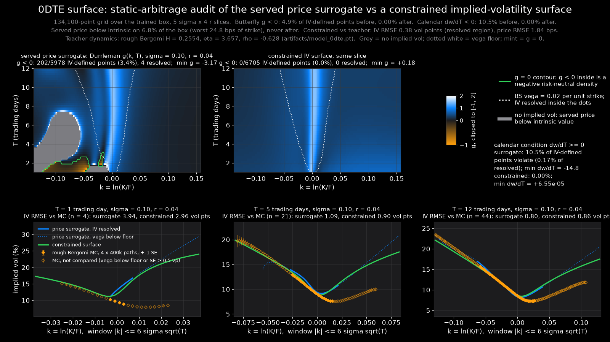

# A no-arbitrage implied-volatility surface for the 0DTE regime, and an arbitrage audit of the served price surrogate

**Summary.** The served 0DTE model (`artifacts/model_0dte.pt`, a 5-member ensemble that
outputs European call *prices*) is not arbitrage-free. Audited by autograd on a
134,100-point grid over its trained box (k = ln(K/F) in [-0.139, 0.157], T in [1, 12]
trading days, five vols, four rates), its implied total variance violates the Durrleman
butterfly condition g(k) >= 0 on **4.9%** of the points where an implied vol exists and
the calendar condition dw/dT >= 0 on **10.5%**; on a further **6.8%** of the box the served
price is *below intrinsic value* (by up to **24.8 bps of strike**), so no implied vol
exists at all, and 1%-wide butterflies can be bought for as little as **-7.1 bps of
strike**. The violations sit almost entirely on the in-the-money side at low sigma sqrt(T)
(92% of butterfly violations at k < -0.05; 59% at sigma = 0.05; 15% of 1-2-day points vs
3% of 8-12-day points), where the true price is a hinge and the ensemble's few-bps
smoothing error is larger than the hinge's time value. Inside the region where the
surrogate's implied vol is actually resolved (BS vega >= 0.02 per unit strike, 42% of the
box) violations are rare - **0.06%** butterfly, **0.18%** calendar - and small.

A constrained surface in the style of Ackerer, Tagasovska & Vatter (2020),
w = sigma^2 T * softplus(MLP), 12,929 parameters, trained in 518 s on CPU against the served
ensemble as teacher with autograd butterfly and calendar penalties, has **zero**
violations of either condition on the same 134,100 points (min g = **+0.072**,
min dw/dT = **+6.5e-5**), never prices below intrinsic, and reproduces the teacher to
**0.22 vol points** RMSE on 32,768 held-out points in the resolved region (0.38 on the
low-vol-heavy audit grid), **0.77 bps** of strike in price (1.84 bps on the grid, dominated
by the 6.8% of points where the teacher is below intrinsic and the surface, by
construction, is not). Against a fresh 4 x 400,000-path rough Bergomi Monte Carlo of the
same dynamics on six smiles, the constrained surface is closer to the truth than its
teacher on four (1-day smiles: 2.96 vs 3.94 and 0.77 vs 1.37 vol points) and farther on
two (by 0.06 and 0.07 vol points); both are tens to hundreds of Monte Carlo standard
errors from the truth at 1-5 days, so the residual error is the teacher's systematic
underfit of the short end, not noise, and the constrained surface inherits it. The
largest inherited error is the teacher's over-pricing of low-vol out-of-the-money calls
(16.30 bps against a Monte Carlo 8.80 +- 0.1 bps at sigma = 0.10, 12 days, k = 0.019;
6.80 against 1.59 at 5 days), which the surface reproduces to within a bp: it is
arbitrage-free, and wrong there in the same way its teacher is.

Everything here was produced by `python -m scripts.no_arbitrage_surface` (752 s on 16 CPU
threads, 8 used by torch; audit 110 s, training 518 s, Monte Carlo 123 s). Numbers are in
`docs/no_arbitrage_surface.json` (rewritten by a `--skip-train` pass that re-audits and
re-runs the Monte Carlo with the same seeds so the per-strike smiles are stored; its
timings are its own), the figure is `docs/no_arbitrage_surface.png`, the surface is
`artifacts/iv_surface_0dte.pt`.



---

## 1. What was built

### 1.1 The served surrogate, read as an implied-volatility surface

`artifacts/model_0dte.pt` is the 5-member MLP ensemble that `PricingEngine` routes every
maturity T <= 12/252 to (`engine._call_price_torch` -> `_zero_dte_call`). It outputs the
European call price per unit strike as a function of (S/K, T, sigma, r) over S/K in
[0.85, 1.15], T in [1, 12] trading days, sigma in [0.05, 0.80], r in [0, 0.10], trained on
rough Bergomi labels with the checkpoint's own dynamics (H = 0.2554, eta = 3.657,
rho = -0.628, Riemann-Liouville kernel, calibrated to SPY on 2026-08-20). Nothing in its
training constrains the surface it produces to be free of static arbitrage; the README
says so. This package measures how far from arbitrage-free it is, and builds a surface
that is.

`backend/quant/iv_surface.py :: TeacherSurface` wraps the engine:

- **Coordinates.** k = ln(K/F) with F = S e^{rT} (the engine drifts the spot at r with no
  dividend), the variable in which the Durrleman and calendar conditions are stated
  (Gatheral & Jacquier 2014). The engine's moneyness is m = S/K = exp(-(k + rT)); the
  shift rT is at most 0.0048. The k box [-0.139, 0.157] is the largest interval whose
  image stays inside the trained S/K box for every (r, T).
- **Inversion.** Prices are inverted to Black-Scholes implied vols by a vectorised
  64-step bisection (no gradient) followed by two Newton steps that autograd *does*
  differentiate. At a converged root the Newton map has zero derivative with respect to
  its starting point, so two steps return the exact implicit first and second
  derivatives of sigma_imp with respect to k and T (one step is exact only to first
  order; the missing term is the one the outer step supplies). Checked against central
  finite differences in `tests/test_iv_surface.py` (relative agreement 1e-4 on w', 1e-3
  on w''). The forward pass runs on float64 copies of the same weights; they reproduce
  the served float32 path to 2.7e-8 in price.
- **Conditions.** Total variance w(k, T) = sigma_imp^2 T. The Durrleman function
  g(k) = (1 - k w'/(2w))^2 - (w'^2/4)(1/w + 1/4) + w''/2 must be >= 0 on every slice
  (the risk-neutral density in k is g e^{-d_-^2/2} / sqrt(2 pi w), so g < 0 is a negative
  density); dw/dT >= 0 at fixed k rules out calendar-spread arbitrage. Both are computed
  by autograd through the surrogate. As a cross-check the price-space conditions are
  evaluated directly through the network with the strike as the free variable:
  dC/dK in [-e^{-rT}, 0], d2C/dK2 >= 0, a discrete 1%-wide butterfly, d(C/S)/dT >= 0 at
  fixed k (exactly equivalent to dw/dT >= 0, because the normalised Black-Scholes price is
  monotone in w at fixed k), dC/dT >= 0 at fixed strike, and the bounds
  max(S - K e^{-rT}, 0) <= C <= S.
- **Resolution.** A price error dP moves the implied vol by dP / vega. The surrogate's
  own accuracy is about 1.5 bps of strike (README), so where the Black-Scholes vega per
  unit strike per unit vol falls below **0.02** (`VEGA_FLOOR`), 1.5 bps is already
  0.75 vol points and the implied vol read off the surrogate carries no information about
  the smile: at sigma = 0.05 and T = 1 day the resolved band is |k| < 0.003, three grid
  cells wide. Every statistic below is therefore reported on the full box **and** on the
  vega-resolved sub-region, and the write-up is careful to say which.

### 1.2 The constrained surface

Following Ackerer, Tagasovska & Vatter (NeurIPS 2020), total variance is modelled as a
positive prior times a positive multiplier,

    w(k, T; sigma, r) = sigma^2 T * softplus( MLP(k, T, sigma, r) + c0 ),   softplus(c0) = 1,

with the flat-vol prior sigma^2 T (arbitrage-free on its own: g = 1, dw/dT = sigma^2 > 0)
and a width-64, depth-4 SiLU MLP (12,929 parameters) whose head is zero-initialised, so
training starts exactly at the prior. Inputs are the affinely normalised (k, T, sigma, r)
plus asinh(k / (sigma sqrt T)) / 3: standardised moneyness is the coordinate in which a
stochastic-volatility smile is nearly stationary, and without it a 1-day, 5%-vol smile is
0.003 wide in k and a small MLP in raw k cannot resolve it.

**Labels.** The served ensemble is the teacher: it is deterministic, differentiable and
cheap (262,144 samples in 9 s), and its systematic error against high-precision rough
Bergomi references is 1.48 bps RMSE (README), below the 2.35 bps per-label noise of a
fresh 20,000-path Monte Carlo set. Regenerating labels by Monte Carlo at that accuracy
would have cost the whole compute budget for a noisier target. The price the teacher
returns, not its implied vol, is the label, because the vol does not exist on 6.8% of the
box (Section 2). Samples are drawn half uniformly in k and half uniformly in
z = k / (sigma sqrt T) on [-8, 8], so the narrow low-vol smiles are sampled as densely as
the wide ones; 7,091 of 262,144 samples (2.7%) whose teacher price lies outside the
no-arbitrage bounds are dropped.

**Loss**, per step on a 4,096-sample data batch and a fresh 4,096-point penalty batch drawn
from the box widened by 10% in k and T:

    L = 2 * mean Huber_delta( (P_nn - P_teacher) / max(vega_nn, 0.02) )
        + 20 * mean relu(0.002 - g)^2
        + 20 * mean relu(0.002 - (dw/dT) / sigma^2)^2
        + 1  * mean relu(|dw/dk| - 2)^2

P_nn is the Black-Scholes price of w_nn, vega_nn is the vega at the network's own implied
vol (detached). Dividing by vega turns a price residual into a vol residual where the vol
is resolved and into a price residual in units of 0.02 (1 bp of price = 0.5 vol-point
equivalents) where it is not, which is `calibrate.py`'s objective against market quotes;
the Huber switch at delta = 0.02 (2 vol points, also `calibrate.py`'s) gives the
teacher's own wrong labels near its low-vol kink linear rather than quadratic influence.
The penalties are the Durrleman and calendar conditions with a small margin so the
trained surface sits strictly inside the feasible set, and the last term is the Lee
(2004) moment bound |dw/dk| <= 2, an asymptotic statement applied inside the box only as a
guard against the multiplier running away in the wings. g and dw/dT on the penalty batch
are computed by autograd with the graph kept, so the penalty gradient is a third
derivative of the network. Adam, lr 2e-3 with cosine decay, 6,000 steps, seed 20260909,
8 torch threads (58 ms per step; 16 threads take 925 ms per step on this CPU because the
third-order autograd of a width-64 MLP is all small matmuls).

---

## 2. Results: the served price surrogate admits static arbitrage

Grid: k in [-0.139, 0.157] in 149 steps (0.002), T from 1 to 12 trading days in
quarter-day steps (45), sigma in {0.05, 0.10, 0.20, 0.40, 0.80}, r in
{0, 0.04, 0.05, 0.10}: 134,100 points, 110 s.

**Coverage.** An implied vol exists on 93.2% of the box. On the other **6.8% the served
price is below intrinsic value** (a synthetic put with negative price), by up to
**24.8 bps of strike** at T = 1 day, k = -0.015, sigma = 0.05, r = 0: the true price there
is intrinsic to within 1e-6 (4.8 standard deviations in the money) and the ensemble
returns 126 bps against an intrinsic 151 bps. Never above spot. The implied vol is
vega-resolved on 42.2% of the box.

| condition (served surrogate) | points | violated | worst | at (T days, k, sigma, r) |
|---|---|---|---|---|
| butterfly g >= 0, all IV-defined points | 124,932 | **4.89%** | g = -151.7 | 1.25, -0.119, 0.20, 0.04 |
| butterfly g >= 0, resolved region | 56,638 | 0.060% | g = -0.190 | 3.75, -0.021, 0.10, 0.00 |
| calendar dw/dT >= 0, all IV-defined | 124,932 | **10.46%** | -14.8 | 3.75, -0.127, 0.05, 0.10 |
| calendar dw/dT >= 0, resolved region | 56,638 | 0.175% | -0.0031 | 10.0, -0.009, 0.05, 0.05 |
| price space: d2C/dK2 >= 0 | 134,100 | 6.89% | -12.7 (x K) | 1.0, -0.023, 0.05, 0.04 |
| price space: 1%-wide butterfly >= 0 | 134,100 | 6.72% | **-7.1 bps of strike** | 1.0, -0.027, 0.05, 0.04 |
| price space: dC/dK <= 0 | 134,100 | 0 | - | - |
| price space: dC/dK >= -e^{-rT} | 134,100 | 8.39% | -0.152 | 1.0, -0.023, 0.05, 0.10 |
| price space: d(C/S)/dT >= 0 at fixed k | 134,100 | 13.15% | -0.080 | 12.0, -0.019, 0.05, 0.05 |
| price space: dC/dT >= 0 at fixed K | 134,100 | 7.70% | -0.047 | 2.25, -0.085, 0.05, 0.00 |
| price space: C >= max(S - K e^{-rT}, 0) | 134,100 | 6.84% | -24.8 bps | 1.0, -0.015, 0.05, 0.00 |

The IV-space and price-space formulations of the same condition agree in sign at
**100.0%** of the IV-defined points (butterfly vs convexity, and dw/dT vs d(C/S)/dT at
fixed k), which is the check that the inversion and its autograd derivatives are right;
the price-space fractions are larger only because they also count the 6.8% of points
where no implied vol exists.

**Where the violations sit.** Butterfly (g < 0, IV-defined points): 14.8% of the points
at 1-2 days violate, 8.6% at 2-4 days, 2.6% at 4-8 days, 3.0% at 8-12 days; 16.1% of the
in-the-money wing (k < -0.05) violates and it holds **92%** of all violations, the centre
|k| <= 0.05 holds 8%, the out-of-the-money wing k > 0.05 holds **none**; by vol, 17.3% of
the sigma = 0.05 points violate (59% of all violations), 7.4% at 0.10 (29%), 2.3% at 0.20
(10%), 0.3% at 0.40, none at 0.80. Calendar (dw/dT < 0): 40.2% of the 1-2-day points and
29.0% of the 2-4-day points violate against 0.9% at 8-12 days; here both wings are hit
(13.8% of the in-the-money wing, 13.6% of the out-of-the-money wing, 3.9% of the centre),
and 52% of violations are at sigma = 0.05, 38% at 0.10, none at 0.40 or 0.80. In the
resolved region the 34 butterfly violations are all at sigma = 0.10 and T >= 2 days near
or below the money, and the 99 calendar violations are all at sigma = 0.05 within
|k| <= 0.05.

**Why there.** At low sigma sqrt(T) the true call price is a hinge: intrinsic on the
in-the-money side, essentially zero on the other, with all the curvature within a few
thousandths in k of the money. The ensemble is a smooth function fitted by least squares
to noisy labels over the whole box; its error is a few bps everywhere, which is what the
README's 1.48 bps RMSE says, but a few bps of *smooth* error on a hinge is enormous
relative to the hinge's own time value. The smoothing undershoots the corner (price below
intrinsic, dC/dK below -e^{-rT}), and the ripples of the fit on the flat in-the-money side
have second derivatives of either sign (d2C/dK2 < 0, a negative density) and time
derivatives of either sign (calendar violations). In implied-vol space the same ripples
invert to violent fake smiles (the -151.7 minimum of g sits 8.4 standard deviations in
the money at sigma = 0.20, T = 1.25 days, where the time value is far below the
surrogate's resolution), which is why the resolved-region numbers are the ones that
describe the smile the surrogate actually produces: there, violations are rare (0.06% and
0.18%) and small (g >= -0.19; dw/dT >= -0.0031, against sigma^2 = 0.0025 for the slope
of a flat 5% vol). The surrogate's smile is mostly fine; its tails and its corner are not,
and those are exactly the places a price-only loss does not see.

---

## 3. Results: the constrained surface

Training: 6,000 steps in 518 s on 8 threads (label generation and the final metrics
included); 255,053 labels. The penalties
never activated - the multiplier started at the arbitrage-free prior and the fit term
never pushed it out of the feasible set (batch minimum g fell to +0.004 around step 2,500,
above the 0.002 margin, and recovered to +0.03 by the end; batch minimum dw/dT / sigma^2
stayed above +0.014).

| | served surrogate | constrained surface |
|---|---|---|
| implied vol defined | 93.2% of box | 100% |
| butterfly g < 0, all IV-defined points | 4.89% | **0** (min g = +0.072 at 4.5 d, k = 0.157, sigma 0.40, r 0) |
| butterfly g < 0, resolved region | 0.060% | **0** (min g = +0.288) |
| calendar dw/dT < 0, all IV-defined points | 10.46% | **0** (min dw/dT = +6.5e-5 at 3.25 d, k = 0.019, sigma 0.10, r 0.05) |
| calendar dw/dT < 0, resolved region | 0.175% | **0** (min +1.3e-4) |
| price below intrinsic | 6.84%, worst -24.8 bps | 0 (Black-Scholes price of a positive w) |
| vs teacher, IV RMSE on resolved region (grid, 56,638 points) | - | **0.376** vol points (MAE 0.245, p95 0.67, max 5.80 at 1 d, k = 0.007, sigma 0.05, r 0.10) |
| vs teacher, IV RMSE on resolved region (32,768 held-out random points) | - | **0.222** vol points (MAE 0.152, p95 0.396, max 3.60) |
| vs teacher, IV RMSE where vega >= 0.05 (held-out) | - | 0.168 vol points |
| vs teacher, price RMSE over the box (grid, 134,100 points) | - | **1.84** bps of strike (1.33 on IV-defined points, 1.52 on resolved points, 5.04 where the teacher is below intrinsic; MAE 0.98, p95 3.41, max 24.9) |
| vs teacher, price RMSE, held-out random points | - | 0.767 bps (MAE 0.478, p95 1.52, max 12.9) |

The grid numbers are worse than the held-out ones because the grid weights sigma = 0.05
and 0.10 at 40% of its points: the resolved-region IV RMSE by vol is 1.01 / 0.42 / 0.27 /
0.20 / 0.35 vol points at sigma = 0.05 / 0.10 / 0.20 / 0.40 / 0.80, and by maturity
1.16 / 0.47 / 0.31 / 0.28 at 1-2 / 2-4 / 4-8 / 8-12 days. The largest differences of all
(5.8 vol points, 24.9 bps) sit at the teacher's 1-day, 5%-vol kink, where the constrained
surface is above intrinsic and the teacher is not; the Monte Carlo check below says which
of the two is right there. The 0.35 at sigma = 0.80 is the box edge: the surface's
multiplier is least constrained by neighbours at the top of the vol range.

---

## 4. Monte Carlo arbiter: both surfaces carry the teacher's short-end error

`rough_bergomi_mc` (unmodified, n_steps = 50, the project protocol) with the checkpoint's
dynamics, r = 0.04, spot 1, all 149 grid strikes on one path set per smile (common random
numbers), 4 independent seeds x 400,000 paths; the implied-vol standard error is the
across-seed spread / 2. Compared strikes: MC implied vol defined on every seed, BS vega at
the MC vol >= 0.02, SE < 0.5 vol points.

| sigma | T (days) | strikes compared | teacher IV RMSE (vp) | constrained IV RMSE (vp) | teacher max | constrained max | median \|z\| teacher / constrained | median MC SE (vp) | teacher price RMSE (bps) | constrained price RMSE (bps) | teacher: no IV at |
|---|---|---|---|---|---|---|---|---|---|---|---|
| 0.10 | 1 | 4 | 3.94 | **2.96** | 5.86 | 4.65 | 958 / 655 | 0.004 | 3.76 | **2.48** | 29 of 149 strikes |
| 0.10 | 5 | 21 | 1.09 | **0.90** | 2.34 | 2.44 | 55 / 18 | 0.010 | 1.88 | **1.59** | 31 |
| 0.10 | 12 | 44 | **0.80** | 0.86 | 2.17 | 2.46 | 30 / 13 | 0.007 | **2.28** | 2.56 | 0 |
| 0.20 | 1 | 9 | 1.37 | **0.77** | 2.78 | 1.91 | 116 / 57 | 0.006 | 2.42 | **1.68** | 51 |
| 0.20 | 5 | 42 | **0.34** | 0.41 | 0.66 | 0.69 | 9.4 / 12.9 | 0.024 | **0.79** | 0.94 | 0 |
| 0.20 | 12 | 86 | 0.27 | **0.08** | 0.47 | 0.26 | 4.4 / 1.0 | 0.042 | 1.20 | **0.53** | 0 |

Three things follow. (i) The Monte Carlo error is not the limiting factor anywhere: with
median |z| of 4 to 958 the disagreements are systematic, and the largest are the
teacher's, at 1-5 days and 10% vol, exactly where its price errors against the same
engine are 2-4 bps RMSE and up to 14 bps (its README figure of 1.48 bps is a box-wide
average). The sign is instructive: at sigma = 0.10 the teacher prices the k = 0.019 call
at 5.32 / 6.80 / 16.30 bps at 1 / 5 / 12 days where the Monte Carlo says 0.00 / 1.59 /
8.80 (standard error <= 0.1 bp), i.e. it over-prices the out-of-the-money wing by
5-8 bps while under-pricing the in-the-money side below intrinsic - the two faces of a
smooth function fitted to a hinge. (ii) The constrained surface is *not* a more accurate pricer than its teacher
in any general sense; it is fitted to the teacher, and it inherits the teacher's short-end
underfit (2.96 vol points at one day). It is closer to the truth on four smiles and
farther on two, by margins (0.06-0.07 vol points, 0.15-0.28 bps) that are small against
the errors both share. Where it wins by a lot - the 12-day 20%-vol smile, 0.08 vs 0.27
vol points, median |z| 1.0 - the improvement is the smoothing and the constraints
removing the teacher's ripples; where it loses, the fit to a wrong label is the loss.
(iii) At one day the teacher has no implied vol at 29-51 of the 149 grid strikes
(price below intrinsic); the constrained surface has one everywhere and its price there
is at least intrinsic, which is what the dashboard needs even before accuracy.


---

## 5. API for the dashboard

`backend/quant/iv_surface.py`, no edits to `main.py`:

```python
class IVSurface:
    @classmethod
    def load(cls, path: Path | str = ARTIFACTS / "iv_surface_0dte.pt") -> "IVSurface"
    def grid(self, sigma: float, rate: float, k_axis: np.ndarray, T_axis: np.ndarray
             ) -> dict[str, np.ndarray]
        # {"k": (nk,), "T": (nT,), "iv": (nT, nk), "total_variance": (nT, nk),
        #  "g": (nT, nk), "calendar": (nT, nk) = dw/dT,
        #  "g_min": 0-d, "g_min_at": [T, k], "calendar_min": 0-d, "calendar_min_at": [T, k]}
    def iv(self, k, T, sigma, rate) -> np.ndarray        # broadcasting numpy inputs
    def price(self, k, T, sigma, rate) -> np.ndarray     # call price per unit strike

def arbitrage_audit(engine_or_surface: PricingEngine | TeacherSurface | IVSurface, *,
                    sigmas=(0.05, 0.10, 0.20, 0.40, 0.80), rates=(0.0, 0.05, 0.10),
                    k_axis: np.ndarray | None = None, T_axis: np.ndarray | None = None,
                    vega_floor: float = 0.02, price_space: bool = True,
                    return_grids: bool = False, chunk: int = 8192) -> dict
    # {"surface", "protocol", "coverage": {iv_defined_fraction, resolved_fraction,
    #   below_intrinsic_fraction, ...},
    #  "iv_space": {butterfly_all_defined, butterfly_resolved, calendar_all_defined,
    #   calendar_resolved: {n_points, n_violations, violation_fraction, worst_value,
    #   worst_at: {T_days, k, sigma, rate}, where: {by_T, by_k, by_sigma}}},
    #  "price_space" (engine only): {convexity_d2C_dK2, butterfly_1pct_bps,
    #   monotone_dC_dK_le_0, slope_dC_dK_ge_-discount, calendar_fixed_k,
    #   calendar_fixed_strike, price_below_intrinsic_bps, price_above_spot_bps,
    #   sign_agreement_butterfly_vs_convexity, sign_agreement_calendar_w_vs_price},
    #  "elapsed_s"}   # plus "grids"/"arrays" when return_grids=True
```

k is ln(K/F) throughout. A 45 x 149 slice through `grid` (implied vol, g and dw/dT by
autograd) measured 41-115 ms on 4 threads while a training job shared the CPU; the
default 20-slice audit of the served engine costs 110 s (autograd second derivatives
through five width-128 members plus the price-space cross-checks) and 0.5 s for the
constrained surface.

---

## 6. Caveats

1. **The teacher is the label, and the teacher is wrong where it is wrong.** The
   constrained surface is fitted to the served ensemble, not to the rough Bergomi model.
   Where the teacher's price is below intrinsic (6.8% of the box) the label is dropped;
   where it is inside the bounds but off by several bps near its low-vol kink, the Huber
   loss limits but does not remove the pull. The Monte Carlo check in Section 4 is the
   only independent arbiter, and it covers six smiles at one rate, not the box.
2. **The wings are the teacher's, errors and all.** Outside the vega-resolved region
   (57% of the box) a 1 bp price difference is worth 0.5 vol-point equivalents in the
   loss, so the multiplier there follows the teacher's wing prices at the bp level, and
   those are wrong at low vol. From the stored per-strike smiles (`mc_smiles` in the
   JSON), at sigma = 0.10 and r = 0.04 the teacher over-prices out-of-the-money calls at
   k = 0.019 by 5.3 bps at 1 day (Monte Carlo 0.00 bps, teacher 5.32), 5.2 bps at 5 days
   (1.59 vs 6.80) and 7.5 bps at 12 days (8.80 vs 16.30, a 0.9-standard-deviation strike
   inside the resolved band; the Monte Carlo price standard error there is 0.1 bp), and
   the constrained surface reproduces those prices (4.26, 7.36, 17.55 bps). In implied
   vol the same numbers read 21-24% against a true 7.6-8.2% at 1 and 5 days: both
   surfaces show a call wing that rises where the rough Bergomi smile keeps falling
   (figure, bottom row, hollow markers). At sigma = 0.20 the wing disagreement is
   0.1-1 bp at 5 and 12 days and 6.5 bps at 1 day. This is the teacher's smoothing of
   the low-vol hinge seen from the other side: the fit that puts 1-day in-the-money calls
   below intrinsic puts out-of-the-money calls above zero, and a surface fitted to its
   prices inherits both.
3. **Zero violations on a grid is not a proof.** The penalties act on random batches and
   the audit on a 149 x 45 lattice per slice; g and dw/dT are checked at 134,100 points,
   not everywhere. The minima on the grid are strictly positive with margin, which is
   evidence, not a theorem. The Lee term is a soft guard inside a finite box, not the
   asymptotic bound it is named after.
4. **The resolution floor is a choice.** `VEGA_FLOOR` = 0.02 was set from the teacher's
   1.5 bp RMSE; halving it doubles the "resolved" area and admits more of the teacher's
   noise into the IV comparisons. The fractions reported "on the resolved region" move
   with it; the fractions "on all IV-defined points" do not.
5. **Static conditions only.** Butterfly and calendar arbitrage are what Durrleman's g and
   dw/dT rule out. Nothing here checks put-call parity against a served put (the engine
   derives puts from the same call), and nothing checks consistency across (sigma, r)
   slices, which are separate surfaces by construction.
6. **One training run.** Seed 20260909, one architecture, one penalty weighting. The
   penalties never activated during training (the surface stayed inside the feasible set
   with g >= 0.004 on every penalty batch), so the weights 20/20/1 were never tested
   against a surface that wanted to violate; a different seed or a stronger fit term could
   need them.
7. **Compute and determinism.** Everything ran on CPU, 8 torch threads; the numbers are
   reproducible from the seed, and the training wall-clock quoted in the JSON is the one
   measured in this run.

## 7. What would falsify this

- *"The served price surrogate admits static arbitrage."* Falsified if the price-space
  conditions - which need no implied-vol inversion at all - held everywhere: they do not
  (d2C/dK2 < 0 on 6.9% of the box, price below intrinsic on 6.8%, 1%-wide butterflies
  worth as little as -7.1 bps of strike). Independent of the vega floor.
- *"Its violations sit where the price surface is (nearly) piecewise linear - the
  in-the-money side at low sigma sqrt(T) - and are of the order of its own price noise."*
  Falsified by violations in the resolved band of comparable magnitude: there are 0.06%
  butterfly and 0.18% calendar violations there, with |g| <= 0.19 and
  |dw/dT| <= 0.003 (vs -152 and -14.8 in the unresolved wing).
- *"The constrained surface has no butterfly or calendar arbitrage on the trained box."*
  Falsified by any grid point with g < 0 or dw/dT < 0; `tests/test_iv_surface.py` checks
  a coarse grid on four (sigma, r) slices and the audit checks 134,100 points. A finer
  grid, a slice at a rate or vol not audited, or a point outside the box could still
  find one; the margins (min g = +0.07, min dw/dT = +6.5e-5) say how much room there is.
- *"It reproduces the teacher where the teacher is resolved."* Falsified if the IV RMSE
  on the resolved region exceeded the 0.5 vol-point test ceiling (measured 0.22 held-out,
  0.38 on the low-vol-heavy grid; 1.01 at sigma = 0.05 alone, which is the teacher's own
  noise at its resolution floor as much as the fit).
- *"Against the true dynamics it is about as accurate as its teacher: better where the
  teacher ripples, no better where the teacher is systematically wrong."* Already
  falsified in the strong form "at least as accurate on every smile": on two of six smiles
  it is worse (12-day 10%-vol by 0.06 vol points, 5-day 20%-vol by 0.07). The weak form
  would be falsified by a smile where it is worse than the teacher by more than the
  teacher's own error (a factor of two), or by a smile where both agree with the Monte
  Carlo to within its standard error while the surface does not.
- *"The residual error at the short end is the teacher's, not the surface's."* Falsified
  if a surface trained on Monte Carlo labels of the same dynamics (the alternative this
  package chose not to run, Section 1.2) reached the Monte Carlo to within its standard
  error at one day with the same architecture and penalties; that would show the
  architecture, not the labels, limits it.

Reproduce: `python -m scripts.no_arbitrage_surface` (matplotlib from
`requirements-dev.txt`); `--quick` for a one-minute smoke run to a temp directory;
`--skip-train` to re-audit the saved surface; `--figure-only` to redraw the PNG from the
JSON. Tests: `tests/test_iv_surface.py` (11 tests, 12 s measured; the whole fast suite,
158 tests, 44 s).
